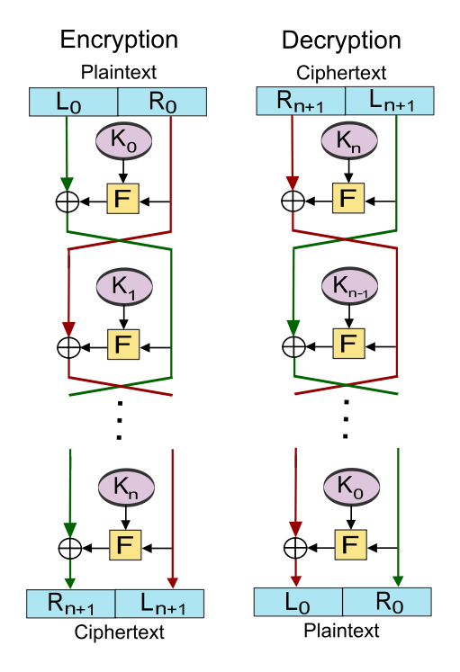

# Feistel 密码  

## Feistel 概述  

Feistel（费斯妥）密码结构，在密码学研究中，Feistel 密码结构是用于分组密码中的一种对称结构，它本身并不是分组密码算法的具体方案，而是一种设计模型。  

很多对称分组加密算法都是基于 Feistel 分组密码结构的，其中包括 DES。Feistel 结构是由许多相同的轮函数组成，每轮使用不同的子密钥，每轮包含了代替和置换两个步骤。  

## 构造细节  

令 F 为轮函数；令 K1, K2, ……, Kn 分别为第 1, 2, ……, n 轮的子密钥。  

加密明文过程如下：  

1. 将明文块拆分为两个等长的块：(L0, R0)；  

2. 在每一轮中，右半部分 Ri 保持不变，作为左半部分下一轮 Li+1 的输入；而左半部分 Li 经过一个依赖右半部分 Ri 和 子密钥 Ki 的运算，作为右半部分下一轮 Ri+1 的输入。运算的规则为，我们使用一个加密函数 F，它接受两个输入——密钥 K 和 R，该函数的输出为 F(R, K)，然后将左半部分 Li 和加密函数结果进行异或计算，得到的结果为 Ri+1。    

   **置换**步骤是指修改过的 L 和未修改过的 R 进行了交换。（Li 经过运算变成了 Ri+1，Ri 变成了 Li+1。）  

   **代替**步骤是指每个明文元素或元素组被唯一地替换为相应的密文元素或元素组。  

   ```  
   Li+1 = Ri；
   Ri+1 = Li⊕F(Ri, Ki)。（其中⊕为异或操作）
   ```

   依次进行 n 轮计算，当最后一轮完成后，两个子块 Rn+1 和 Ln+1 按顺序连接起来，形成密文块(Rn+1, Ln+1)。  

解密密文过程如下：   

1. 对于密文(Rn+1, Ln+1)，通过计算 i = n, n-1, ......, 0，对密文进行加密的逆向操作；  

2. 在每一轮中，进行如下运算（i  为当前轮数）：  

   ```
   Ri = Li+1；
   Li = Ri+1⊕F(Li+1, Ki)。（其中⊕为异或操作）
   ```

   依次进行 n 轮计算，结果(R0, L0)就是明文。   



## 影响因素  

影响Feistel 结构的因素有如下5 个：  

- 块的大小：大的块会提高加密的安全性，但是会降低加密、解密的速度。截止至2013年，比较流行的这种方案是 64 bit。而 128 bit 的使用也比较广泛。  
- 密钥的大小：同上。现在流行的是 64 bit ，而 128 bit 正逐渐成为主流。  
- 迭代轮数：Feistel 密码的轮数量取决于系统所需的安全性，轮数越多系统越安全。但更多的轮数意味着加密和解密过程增多，效率越低。现阶段比较流行的是 16 轮。  
- 子密钥的生成算法：生成算法越复杂，则会使得密码被破译的难度增强，即，信息会越安全。  
- 轮函数的复杂度：轮函数越复杂，则安全性越高。