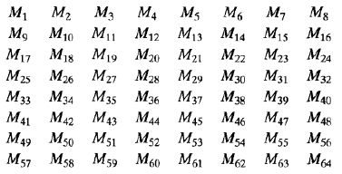
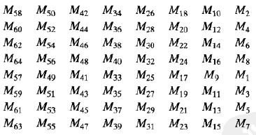
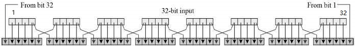
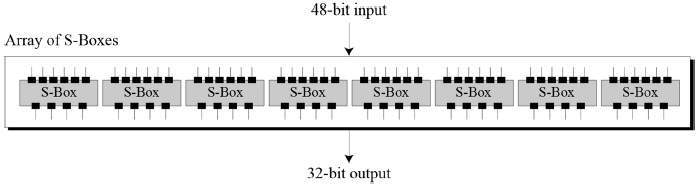
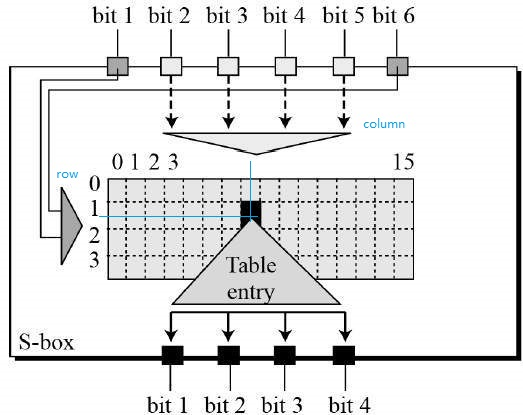
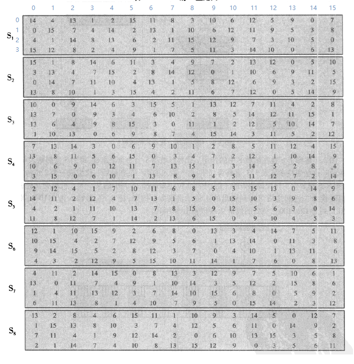
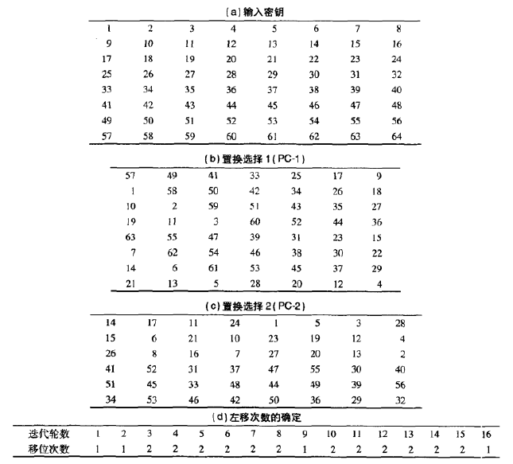

# 数据加密标准(DES)  

## DES 加密概述  

数据加密标准（Data Encryption Standard，缩写为 DES）是由国家标准局（NIST）出版的对称密钥分组密码（块密码）。  

对于任何加密体制，总有**明文**和**密钥**两个输入。DES是费斯妥密码（Feistel Cipher）的一种实现，进行16轮迭代，其明文长度为64 bit，密钥长度也是64 bit（但只有56 bit被实际用于算法，其余8 bit可以被用于奇偶校验，并在算法中被丢弃）。  

DES的一般结构如下图所示，可见明文的处理经过了三个阶段。  

1. 首先，64 bit明文经过**初始置换（IP）**而被重新排序；  
2. 然后，经过16轮相同的**费斯妥函数**的处理过程，每轮包含了代替和置换两个步骤；  
3. 最后， 再进行一次**与初始置换互逆的置换（IP-1）** ，得到64 bit的密文。  

除了初始和末尾的置换，DES的结构与费斯妥密码结构完全相同。  

## 算法描述  

### 初始置换和末尾置换  

初始置换和末尾置换只是对输入按位重新组合，在DES中没有密码学意义，初始置换和末尾置换如下所示： 

输入的第58位换到第1位，第50位换到第2位，...，依此类推，最后一位是原来的第7位。假设输入的64位块为M1M2M3......M64，则经过初始置换后的结果为M58M50M42...M7。  

64位的输入M：    

这里Mi都是二进制，经过置换 X=IP(M)之后，得到的X：  

### 费斯妥函数（F函数）  

DES加密的核心是费斯妥函数，即每轮的变换。由费斯妥密码结构可知，明文会被均分成两等分，右半部分和密钥经过费斯妥函数处理。对于DES加密，48 bit子密钥（由主密钥派生）和32 bit右半块作为费斯妥函数的输入，处理后输出32 bit结果。  

下图是费斯妥函数的内部结构。密钥Ki长度为48 bit，R长度为32 bit。分为四个步骤：  

1. 将R**置换扩展**为48 bit，其中有16 bit是重复；  
2. 置换扩展产生的48 bit输出与48 bit的Ki异或；  
3. 异或的结果经过“S盒”（置换盒），产生32 bit的输出；  
4. “S盒”的输出最后再经过一次P置换，得到的32 bit是费斯妥函数的输出。  

#### 扩展置换  

因为右半块长度是32 bit，而密钥长度是48 bit，因此，需要先把右半块扩展到48 bit，称为“扩展置换”。扩展置换是将输入的32 bit半块分成8个4 bit小块，每4 bit块加上左右相邻块中紧邻的位，得到6 bit输出。第1块没有左邻，用第32位，最后一块没有右邻，用第1位。扩展置换输出8个6 bit的块，其逻辑如下：  

扩展置换逻辑通常被描述为下图的DES规范表格：  

#### 与密钥混合  

用异或操作将扩展的48 bit右半块和一个48 bit子密钥进行混合。16轮变换使用16个48 bit子密钥，也就是每轮用的子密钥都是不同的，48 bit的子密钥是利用密钥调度（下面介绍）从58 bit主密钥生成。    

#### S盒（置换盒）  

48 bit的异或输出再经过S盒处理，产生32 bit的输出。S盒执行真正的混淆，它提供了DES的核心安全性。如果没有S盒，密码会是线性的，很容易破解。DES使用8个S盒，每个盒子以查找表方式提供非线性的变换，将6 bit输入变成4 bit输出。  

S盒是一个4x16的表，盒Si输入的6 bit中，由第1位和第6位组成的二进制数确定表的行，中间4位组成的二进制数确定表的列，行和列交叉的元素转换成4 bit二进制数作为输出。  

DES的8个S盒变换表（下标从0开始）规格如图所示：  

例如，在S1中，若输入为011001，则行是1(01)，列是12(1100)，由行和列确定的元素是9(1, 12)，9对应的二进制为1001，因此4 bit输出为1001。  

#### 置换  

S盒的32 bit输出最后再经过一次“P置换”进行重组。这个设计是为了将每个S盒的4位输出在下一回次的扩张后，使用4个不同的S盒进行处理。置换表格如下图所示：  

S盒，P置换和E扩展各自满足了克劳德·香农在1940年代提出的实用密码所需的必要条件——“混淆与扩散”。  

### 密钥生成  

前面我们知道，密钥长度为64 bit，算法只用56 bit。循环密钥生成器从56 bit密钥中创建16个48 bit子密钥。密钥生成过程如下图所示。  

首先，使用选择置换1(PC-1)从64 bit输入密钥中选出56 bit的密钥，剩余的8 bit要么直接被丢弃掉，要么作为奇偶校验位。  

然后，将56 bit密钥分成两个28 bit的半密钥。在接下来的每轮变换中，两个半密钥都被左移1或2位（左移1还是2由当前的迭代轮数决定），移位后的值作为下一轮的输入，并且通过选择置换2(PC-2)压缩成48 bit的子密钥。  

解密过程中，除了子密钥输出的顺序相反外，密钥调度的过程与加密完全相同。  

置换选择以及移位次数如下图所示：  

## 安全与密码分析  

DES满足分组密码的两个要求，这两个特性使加密非常强大。  

- 雪崩效应——明文或密钥的微小改变将对密文产生很大的影响。  

- 完备性——每一位密文都依赖于许多位明文。  

到当前为止，最实用的攻击方法仍然是暴力攻击。虽然有3种理论攻击（差分密码分析、线性密码分析和改进的戴维斯攻击）的理论复杂性小于暴力破解，但需要不现实的已知明文或选择明文数量，并无实用价值。  

DES已被证明是一种设计良好的分组密码。除了暴力穷举密钥搜索外，DES没有受到任何重要的密码分析攻击。为抵抗暴力破解，有大量的DES的代替算法，最重要的有AES和3DES。  

