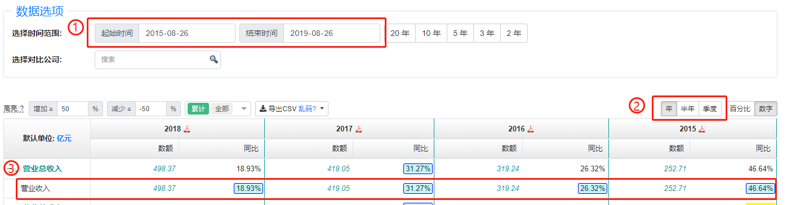
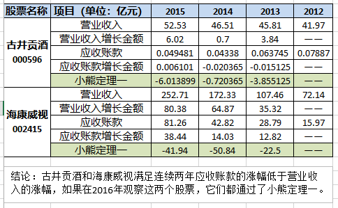
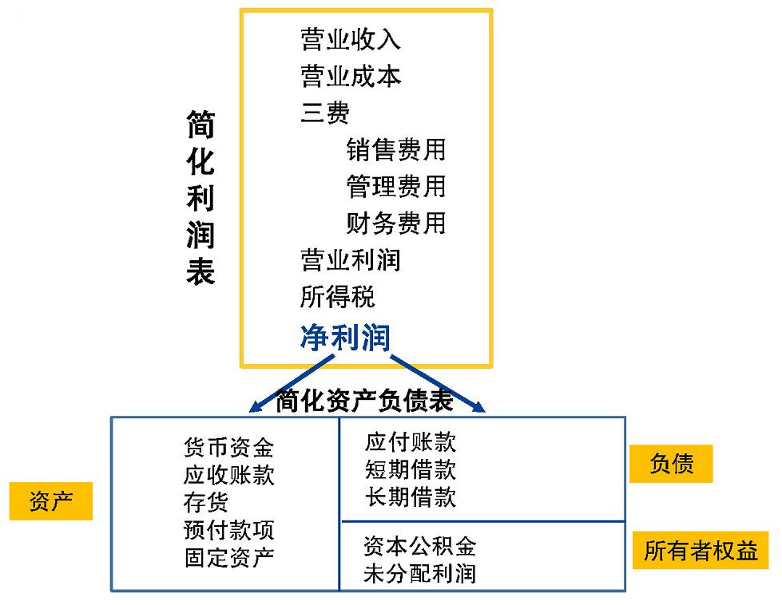
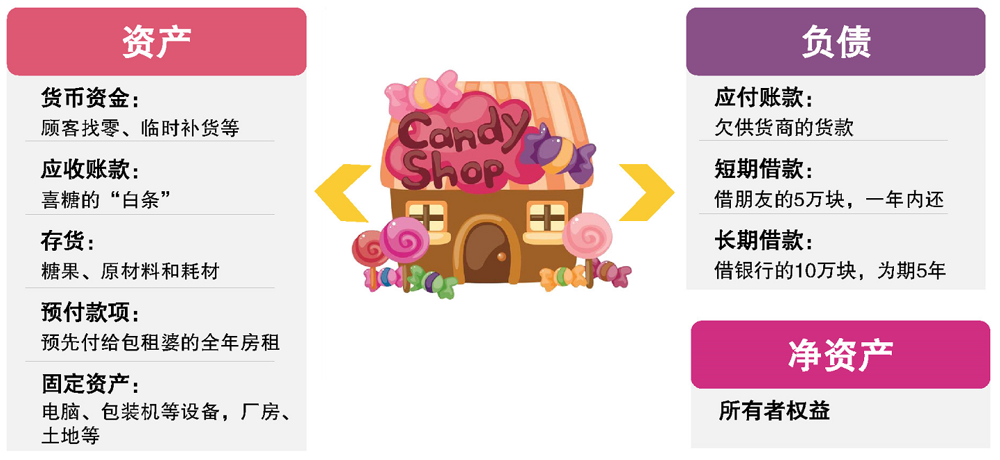

# 财务三表分析  

## 0x00 写在前面  

白马股的第三个特点是信息相对可靠，我们要了解一个公司，大多数都是借助公司的财务报表，但是并非所有上市公司的财务报表都是可靠的，财务报表会被或多或少地美化，因此，我们要剔除哪些过多地美化财务报表的公司。  

## 0x01 认识财务报表  

### 什么是财报  

财务报表是指从会计角度记录公司所有经营事务的报表，按时间可分为**季度报表**、**半年报表**、**年度报表**。  

财务三表指的是**利润表**、**资产负债表**和**现金流量表**。  

**利润表**：又叫损益表，主要体现公司一段时间内是赚钱还是亏钱。  

**资产负债表**：记录特定的某一天，公司有多少钱、财、物以及欠别人多少钱。  

**现金流量表**：开支流水账，记录了公司花出去多少钱，收到多少钱。  

## 0x02 小熊定理一    

**连续2年应收账款上升幅度大于营业收入上升幅度，可以看出公司有美化收入的嫌疑，剔除掉**。Why？别急，且听我慢慢道来。  

### 看懂利润表  

公司的收入记录在利润表，专业名词叫**营业收入**，指公司卖出产品所赚到的钱，体现公司在一段时间内是赚了还是亏了。  

```
营业收入 - 营业成本 - 三费 = 营业利润  
营业利润 - 所得税 = 净利润  
```

营业收入，卖东西的收入；  

营业成本，购买生产货物的原材料等所付出的钱；  

三费，包括管理费用、销售费用、财务费用。  

由以上公式可看出，**收入的多少直接影响着公司利润的多少**。简化的利润表如下图所示：  


### 了解会计的记账  

实际生活中，我们的交易都是一手交钱一手交货。而在企业的交易中，情况就比较复杂了，不是所有的交易都是立即完成的。  

以二狗的糖果店为例，我们来看一下公司的营业收入在会计上是怎样记账的。  

> 客户买几袋糖付几袋钱 -> 收到的钱就是糖果店的收入，直接记入营业收入。  
>
> “大客户”付钱预定1999包糖 -> 预收账款，不记入营业收入。货给客户后，才转入营业收入。因为客户付了钱，你之后要给客户货物，属于负债，因此不记入营业收入。    
>
> 邻家赊账 -> 应收账款增加、营业收入增加。因为客户还没付款，之后客户要还款给你，属于资产，因此记入营业收入。  

虽然**应收账款**不一定收得回来，但是它都是记入营业收入。因此，上市公司会利用这个漏洞来美化收入。  

### 美化收入的猫腻  

前面了解到公司可以利用应收账款来美化公司收入，我们还是以二狗糖果店为例，戳穿二狗美化收入的歪招。  

> 第一年，二狗往超市送去100袋糖果，年末超市只卖出了50袋。  
>
> 第二年，二狗又往超市送去120袋糖果，年末超市只卖出了50袋。  
>
> 第三年，二狗继续往超市送去130袋糖果，年末超市只卖出了40袋。  

利润表中，卖货量一直增加，营业收入也一直增加，糖果店的业绩杠杠的。而实际上，账面营业收入增加是假的！  

咦？二狗居然做假账？我们来分析一下糖果店连续两年的应收账款增长幅度和营业收入增长幅度，假设单价1000元/袋，糖果店账本（单位：万元）：  

|               | 营业收入 | 应收账款       |
| ------------- | -------- | -------------- |
| 第1年         | 10       | 5              |
| 第2年         | 12       | 5 + 7 = 12     |
| 第3年         | 13       | 5 + 7 + 9 = 21 |
| 第2年增长金额 | 2        | 7              |
| 第3年增长金额 | 1        | 9              |

糖果店连续2年的应收账款增大幅度，都大于营业收入的增长幅度！  

### 实操  

以海康威视为例，咱们来看一下它是否能通过小熊定理一的检验。  

1. 打开 [理杏仁](https://www.lixinger.com/) 网站，在右上方搜索框输入“海康威视”，点击进入；  

2. 点击进入“利润表”页面，我们要看最近3年的增长情况，所以要查找4年的数据；  

3. 在①“选择时间范围”处，设置起始时间和结束时间。假设现在是2019年8月26日，就将起始时间设置为2015年8月26日，结束时间为2019年8月26日；在②选择“年”；复制③处营业收入数据到Excel表格，删除同比增长比例；  

   

4.  使用减法公式，计算每年营业收入的增长金额；  

5. 点击进入“资产负债表”页面，同样的方法，找到”应收账款“，把数据复制到Excel表格，计算每年应收账款的增长金额；  

6. 比较每一年营业收入和应收账款各自增长的幅度，可以用当年的应收账款增长金额 - 营业收入增长金额；  

   ```  
   如果 > 0，说明应收账款涨幅更大；如果 < 0，则说明营业收入涨幅更大。  
   连续2年 > 0时，就说明这个公司连续2年应收账款上升幅度大于营业收入上升幅度，我们就要当心了。如果连续2年的增长金额分别一年大于0，一年小于0，或者连续2年小于0，就不需要担心。  
   ```

7. 下图是古井贡酒和海康威视两家公司在2012年到2015年的营业收入和应收账款的增长金额。    

   

**注意，因为银行业务的特殊性，并没有应收账款等科目，银行股不适合用小熊定理一。**

## 0x03 小熊定理二  

**连续2年存货增长大于营业收入的增长，这家公司的存货可能有问题，我们要避开**。  

### 看懂资产负债表  

核心：`资产 = 负债 + 所有者权益`  



二狗的糖果店资产负债如下：

  

### 美化收入的猫腻  

了解资产负债表以后，如果要让我们去美化资产，你会从哪里入手呢？没错，就是存货。  

存货不仅指生产出的货物，还包括生产用的原材料、生产过程中的半成品，“存货”包含的项目比较多，从财报中能看到资金总额，这就给了别用用心的公司一个机会！  

> 著名的“獐子岛”事件，公司在2011年和2012年累计向大海中播撒了100多万亩、价值7.6亿元的虾夷扇贝。  
>
> 2014年獐子岛发布公告，因北黄海遭到异常冷水团，即将进入收获期的虾夷扇贝绝收。  
>
> 公司的业绩由盈利转为巨亏8.12亿元。其股价短短一个多月跌去了30%。  

这到底是道德的沦丧还是人性的扭曲？后来证实，獐子岛集团存在造假。由于存货的复杂性，很容易出现造假行为。作为一个难以看清所有真相的普通投资者来说，我们要做的就是通过已知的信息和科学的分析，判断出可能存在资产美化的公司，然后尽量地避开它们。  

### 实操  

计算方法跟小熊定理一是一样的，因此操作步骤参考小熊定理一即可，不同的是小熊定理一用的是**应收账款增长金额**，而小熊定理二用的是**存货增长金额**。其中，**存货**数据在理杏仁的“资产负债表”页面能找到。  

```  
比较每一年营业收入和存货增长金额的差异，用当年的存货增长金额减去营业收入增长金额。  
如果结果 > 0，说明存货涨幅更大；如果 < 0，则说明营业收入涨幅更大。  
当出现连续2年结果都 > 0，就说明这个公司连续2年存货增长金额大于营业收入增长金额，要当心了。  
```

## 0x04 小熊定理三  

**如果一家公司的流动负债远大于流动资产的话，说明这家公司已经非常接近于破产了**。  

**流动资产**：一年内可以变现的资产，如货币资金、存货、预付款项；  

**流动负债**：一年内必须要还的钱，如应付账款、短期借款等；  

**流动比率**：流动资产 / 流动负债；  

**如果企业的流动比 < 1，说明流动资产小于流动负债，可能要破产了**。  

流动比率不需要计算，理杏仁网站搜索相应的股票，进入”资产负债表“页面，在“流动资产合计”项目中就可以直接看到，我们比较最近三年的流动比率就可以啦。  

```  
流动比率，最近三年有两年都小于1，这样的公司要当心！  
```

## 0x05 总结  

**小熊定理一**：能看出一家公司是不是有美化收入的嫌疑，如果一家公司连续2年应收账款上升幅度大于营业收入上升幅度，就说明这家公司需要警惕。  

**小熊定理二**：能看出一家公司是不是有美化资产的嫌疑，如果一家公司连续2年存货增长大于营业收入增长，就说明这家公司有的存货可能有问题。  

**小熊定理三**：能轻松鉴别公司是否有破产的风险，如果一家公司近3年有2年流动负债远大于流动资产，就说明这家公司已经接近破产了。  

现金流量表引申出了**小熊定理四**和**小熊定理五**，但这涉及到个股的分析，是相对比较复杂的，这里不做具体阐述。