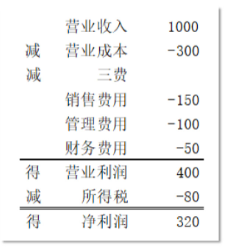
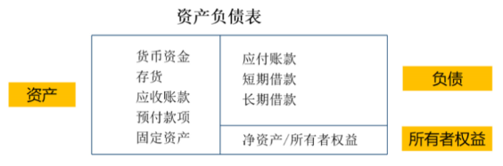
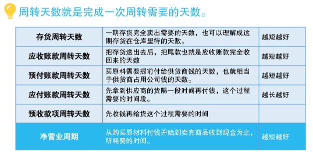
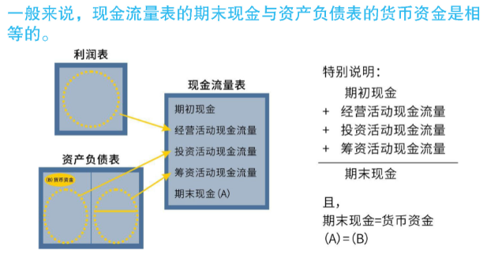
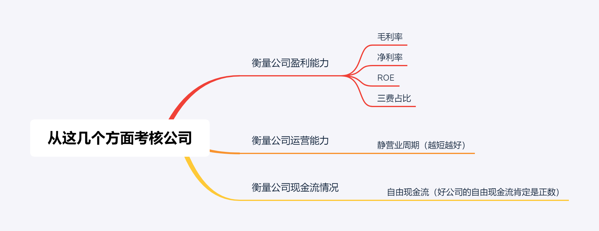
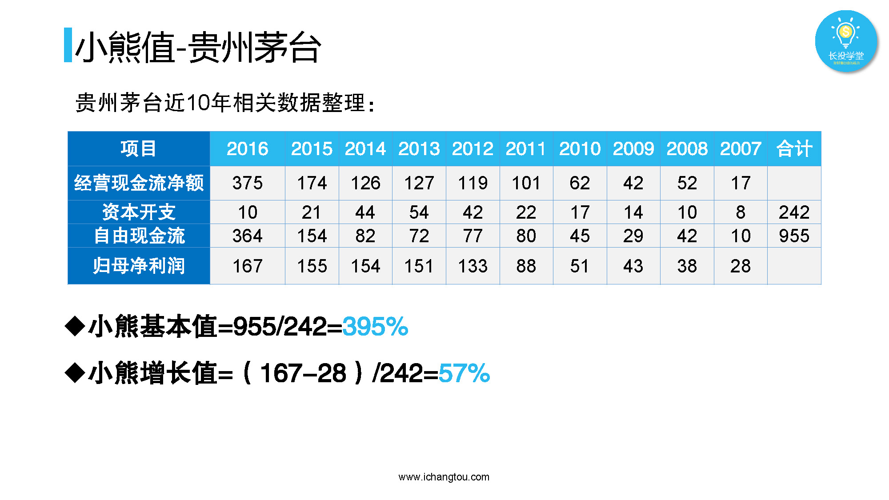
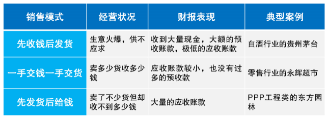

# 好生意  

## 温习财务三表

### 财务三大报表——利润表   

利润表，又叫损益表，主要体现公司在一段时间内是赚钱还是亏钱。因此，通过看公司的净利润，我们就知道这段时间公司是亏了还是赚了。  



由利润表的组成可知，影响净利润的因素有营业收入、营业成本、三费和所得税，但是所得税这部分一般有很大变化，因此，用4个指标来衡量公司的盈利能力。  

- 毛利率  

  ```
  毛利率 = 毛利润 / 营业收入  
  毛利润 = 营业收入 - 营业成本
  ```

  毛利率主要反应的是公司销售产品或者服务带来的盈利情况。  

- 净利率  

  ```
  净利率 = 净利润 / 营业收入   
  ```

  净利润是公司花出去的原材料成本以及各种费用之后的利润，看的是公司的纯利润占所有收入的比例。 

- 净资产收益率ROE  

  ```
  ROE = 净利润 / 净资产  
  归属于母公司股东的ROE = 归属于母公司股东的净利润 / 归属于母公司股东的净资产  
  ```

  常用的ROE是加权ROE和归属于母公司股东的ROE，ROE反应了整个经营过程中各类净资产变化对盈利能力的影响。  

- 三费占比  

  ```
  三费占比 = (销售费用 + 管理费用 + 财务费用) / 营业收入
  ```

  三费占比越低说明这家公司管理经营所需要的费用越低，费用低代表着总成本越低。  

### 财务三大报表——资产负债表   

资产负债表，记录了在特定的某一天，公司有多少钱、财、物以及欠别人多少钱。  



我们用**净营业周期**来衡量公司的运营效率。  

```
净营业周期 = 存货周转天数 + 应收账款周转天数 + 预付款项周转天数 - 应付账款周转天数 - 预收账款周转天数  

由于港股没有披露预收、预付款项，因此在计算港股的净营业周期公式简化为：  
净营业周期 = 存货周转天数 + 应收账款周转天数 - 应付账款周转天数
```



**净营业周期就是理杏仁里的现金周转天数。**

### 财务三大报表——现金流量   

现金流量表，主要记录的就是公司里现金流入流出的情况。现金流量表最主要的三个部分：  

经营活动产生的现金流量（主要来自利润表对应的活动）  

投资活动产生的现金流量（主要来自资产负债表的资产对应的活动）  

筹资活动产生的现金流量（主要来自资产负债表的负债对应的活动）  

  

**自由现金流**是衡量公司现金流情况的指标，代表着公司真正能自由运用的资金。  

```
自由现金流 = 经营活动产生的现金流量净额 - 资本开支  

经营活动产生的现金流量净额 = 所有经营活动收到的现金 - 所有经营活动支付的现金  
资本开支，就是购建固定资产、无形资产和其他长期资产所支付的现金
```

经营活动对应的是**经营活动产生的现金流量净额**；  

投资活动对应的则是**投资活动产生的现金流量净额**；  

筹资活动对应的便是**筹资活动产生的现金流量净额**。  

### 总结  



## 好生意的两个条件  

- 公司能活得久  
- 公司能赚得多  

### 活得久  

分析公司在所处行业的**市场容量（市场潜力）**和**市场竞争**大小，市场容量大，市场竞争小能让公司活得久。  

#### 市场容量  

- 国内保有量比较法  

  该方法的核心是用生活常识和搜索到数据计算市场容量。  


- 看证券公司的研报  

  多看几份不同券商公司的行业研报，结合对比。  

#### 市场竞争  

行业的竞争格局，影响着行业能否为企业提供稳定的生存环境，进而影响着企业是否能够活得久。  

通过**企业数量**和**市场集中度**来判断行业处于哪种竞争格局。  

市场集中度是指行业中前几家企业所占的市场份额之和，用符号CRN表示，其中N表示前N家企业。CR4则表示行业中前4家企业所占的市场份额之和。  

| 竞争格局 | 企业数量 | CR4             | CR8             | 竞争程度 |
| -------- | -------- | --------------- | --------------- | -------- |
| 完全竞争 | 很多     | CR4 < 20%       | CR8 < 30%       | 激烈     |
| 垄断竞争 | 较多     | 20% ≤ CR4 < 40% | 30% ≤ CR8 < 50% | 强       |
| 寡头竞争 | 很少     | 40% ≤ CR4 < 70% | 50% ≤ CR8 < 85% | 较弱     |
| 完全垄断 | 几个     | CR4 ≥ 70%       | CR8 ≥ 85%       | 弱       |

### 赚得多  

能给公司带来更多现金流的生意才是好生意。  

通过**现金流三拷问**来判断公司具不具备杠杠的赚钱能力。  

第一问，投资环节消耗的现金流有多少？  

第二问，生产环节是否能占用免费现金？  

第三问，销售模式能让企业赚到更多真金白银么？  

#### 投资环节  

啥？投资环节消耗的现金流？  

就是资本开支，资本开支是购建固定资产、无形资产和其他长期资产所支付的现金，说白了就是买设备厂房，或者其他可以使用很久的资产花出去的现金。  

我们的目标是找那些花得少赚得多的生意，这种生意不仅投资环节消耗的资本少，而且创造利润和自由现金流的能力还很强。  

可以应用**小熊值**来计算公司的资本投入和其产生的自由现金流或者利润增长之间的关系。  

小熊值分为**小熊基本值**和**小熊增长值**，判断**只要满足任意其中一个就行**。  

##### 小熊基本值  

```  
小熊基本值 = 公司十年的自由现金流总和 / 十年的资本开支总和 * 100%  
```

数值越大，说明付出同样的资本开支，创造的现金流越多。  

一般来说，小熊基本值要大于100%。  

```
小熊基本值 > 200%，比较优秀  
小熊基本值 < 100%，公司生意处于前期发展阶段，需要不断将现金花出去建立商业帝国，只要过了这个时期小熊值会迅速提升。  
小熊基本值 < 50%，公司没啥前景，不考虑
```

##### 小熊增长值  

```  
小熊增长值 = 公司十年的净利润增长 / 十年的资本开支总和 * 100%
```

这个值衡量公司这十年为了利润增长需要投入的钱。  

数值越大，付出同样的资本开支，产生的利润增长越大，通过这个值可以了解一家公司想要利润增长是不是需要很多的投入。  

```
小熊增长值 > 10%，及格  
小熊增长值 > 30%，优秀  
小熊增长值 < 1%，甚至为负，公司的生意利润增长艰难
```

小熊值的计算涉及到3个数值：自由现金流、净利润和资本开支。  

**自由现金流**在理杏仁的“财务指标”页面可以找到；**净利润**使用的是“归属于母公司股东的净利润”，剔除了不属于母公司的部分，更能反映出公司的净利润情况；**资本开支**对应的是理杏仁的“现金流量表”页面的“购建固定资产、无形资产及其他长期资产所支付的现金”。  



分析企业时，需要将其小熊值与同行业不同公司比较，其在行业内是否优秀，同时也需要与不同行业进行比较，看他做的生意是否足够好。  

#### 生产环节  

生产环节占用别人免费现金就是“吃上游、卡下游”。    

- 原材料我先拿了，钱慢慢付给你。  
- 想买货？先交钱给我，货做好了再发给你！  

换而言之，就是**占用别人的资金 > 别人占用自己的资金** 。  

对上下游企业的资金占用情况的衡量指标是**净营业周期**。  

```  
净营业周期 = 存货周转天数 + 应收账款周转天数 + 预付款项周转天数 - 应付账款周转天数 - 预收账款周转天数  

由于港股没有披露预收、预付款项，因此在计算港股的净营业周期公式简化为：  
净营业周期 = 存货周转天数 + 应收账款周转天数 - 应付账款周转天数
```

衡量公司对上下游企业的资金占用情况，不仅要考虑资金的多少，还要考虑占用的天数。  

**存货周转天数 + 应收账款周转天数 + 预付款项周转天数**反映了别人占用我们公司的资金回到公司所需要的天数；  

**预收款项周转天数 + 应付账款周转天数**反映我们公司占用别人资金的天数；  

两者相减，便可以知道运营中企业是否占了别人的便宜。  

**净营业周期越小越好。**  

如果是负数，说明我们占用别人的资金回收周期 > 别人占用我们的资金回收周期，我们在上下游关系中更具有优势。  

**在使用净营业周期分析企业时，观察企业3~5年的数据会更加准确。**   

#### 销售模式  

生意的销售模式能让企业赚到更多的真金白银吗？  

有三种销售模式，如下表所示：  



三种销售模式决定了衡量销售模式产生现金流的3个指标：  

1. 销售收现率（一手交钱一手交货）  

   ```
   销售收现率 = 销售商品提供劳务收到的现金 / 营业收入
   ```

   反映公司的生意在销售中创造现金的能力，值越高越好，销售收现率越高，说明营业收入中真金白银占的比例越多。  

2. 白条率（先发货后给钱）  

   ```
   白条率 = 应收款项 / 营业收入
   ```

   越小越好，白条率越小，说明公司在销售环节真正收到的现金越多。

3. 预收率（先收钱后发货）    

   ```
   预收率 = 预收款项 / 营业收入
   ```

   越大越好，预收率越大，说明企业在销售中“先收钱再发货”的情况越多，带来的现金流入也当然越多。  

### 总结  

**好生意的两个特点：**  

1. 能让公司活得久  
2. 能让公司赚得多  

**判断好生意的方法有两招：**  

1. 生意要想活得久，市场潜力要大，市场竞争要小。  
2. 处于不同行业的公司，它的生意模式在存活的时间里是否能够创造更多的现金。

**通过现金流三拷问考核企业创建现金流的能力：**  

第一问：投资环节消耗的现金流有多少？用小熊值来判断。数值越大，说明企业的投入产出比越大。  

第二问：日常的生产运营是否能占用免费现金？用净营业周期来判断。净营业周期越小越好，如果为负，说明企业能够长期占用上下游的资金。  

第三问：生意的销售模式能让企业赚到更多的真金白银么？用销售收现率、白条率、预收率三个指标来判断。销售收现率越高，白条率越低，预收率越高，说明企业的销售模式越能创造现金。  

