# 好公司——商业逻辑  

分析一家公司是不是好公司的4个步骤：  

1. 了解这家公司；  
2. 有没有护城河；  
3. 公司的盈利源泉是什么；  
4. 公司的盈利源泉未来能不能持续。  

## 分析公司的商业逻辑  

如果能回答出以下几个问题，我们就能对一家公司有一定的了解。  

1. 公司是做什么的？（业务基本范围）  
2. 公司靠什么挣钱？（主要业务构成）  
4. 用什么生产？（成本构成）  
4. 原料问谁买？产品或服务卖给谁？（上下游） 
5. 公司产品或服务怎么卖？（销售模式）  
6. 公司有没有同行？有哪些同行？  
7. 公司老板是谁？（公司实际控制人）  
8. 分红不分红？（分红历史）   
9. 公司待遇好不好？（高管薪酬）  
10. 公司有没有同行？有哪些同行？（竞争关系）  

通常我们可以通过公司的年报来找答案。  

### 公司年报下载    

以索菲亚2017年年报为例，进入[萝卜投研网](https://robo.datayes.com/)，在搜索框输入“索菲亚2017年年报”，点击打开，然后再点击下载图标就可以下载了。  

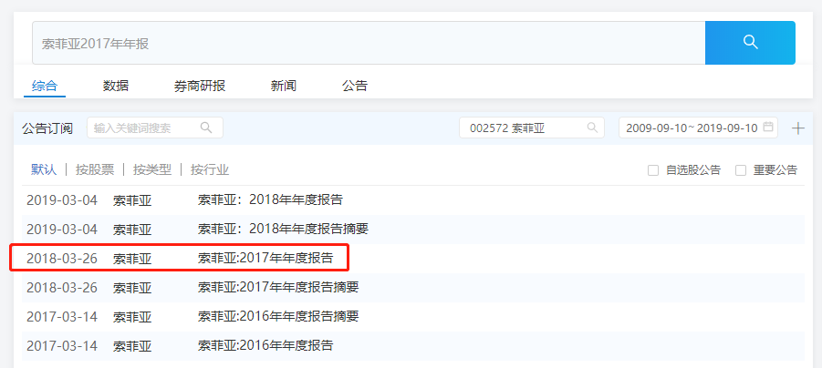

### 公司是做什么的  

年报里通常会有一节叫“**公司业务概要**”，这部分内容就会告诉我们公司是干么的，年报中对索菲亚的业务描述地很清楚：  

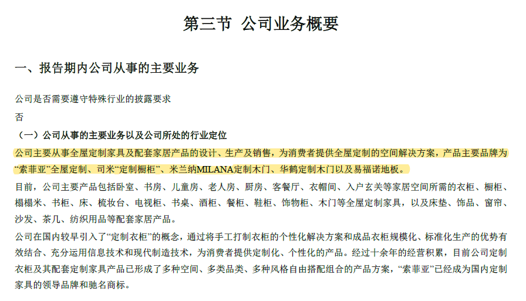

公司主要从事全屋定制家具及配套家居产品的设计、生产及销售，为消费者提供全屋定制的空间解决方案，产品主要品牌为“索菲亚”全屋定制、司米“定制橱柜”以及木门、地板等等。  

### 公司靠什么挣钱  

年报中有一章叫“**经营情况讨论与分析**”。关于公司靠什么挣钱这个问题的答案经常会出现在这一章里。在“**经营情况讨论与分析**”下的“**主营业务分析**”小节里，会看到关于索菲亚主营业务的拆解。另外，这里有个小技巧，我们可以通过“**主营业务**”关键词在年报里搜索。  

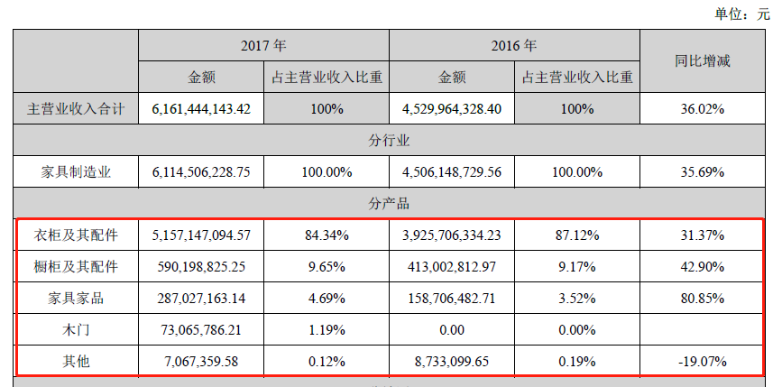

2017年，索菲亚的主营业务中，“衣柜及其配件”全年销售额为51亿多，占到主营收入的84.34%。毫无疑问，衣柜业务是索菲亚目前最主要的业务，但是仔细看下去就会发现，衣柜业务的营收2017年比2016年绝对值上升，但是占比却在下降。2016年衣柜业务占比达87.12%，但是17年占比就下降到84.34%。  

为什么？因为橱柜业务和家具家品业务都在提升，且提升速度快于衣柜业务。这两者占比提升，导致衣柜业务占比下降。  

现在我们知道了衣柜业务占比最大，对营收贡献也最大，但是哪种业务最挣钱呢？看哪种业务挣钱主要看什么呢？  

看毛利率，所以，我们接着往下看。也是在“主营业务分析”小节里，往下翻两页就能看到另一张表。  

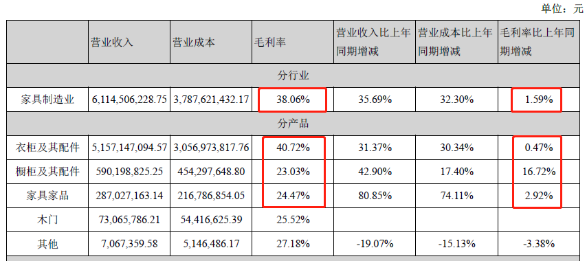

从表中数据可以知道，索菲亚整体业务的综合毛利率为38.06%，而衣柜业务毛利最大为40.72%。所以，衣柜业务不仅在营业收入中占比最大，而且最挣钱。  

不过，这里大家可以注意到2017年索菲亚除了衣柜业务外，橱柜和家具家品业务的毛利也有较大提升，因此导致综合毛利率提升1.59%。  

### 用什么生产  

这个问题牵涉到的是原材料，也就是说索菲亚的产品是由哪些原材料生产的。我们可以看一下索菲亚的成本构成，同样在“**营业务分析**”小节里，有一张表是关于**营业成本**构成的。  

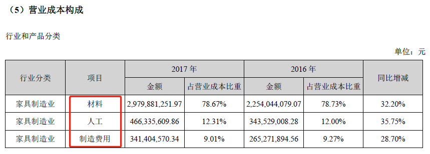

索菲亚的成本主要由三大项构成：**材料、人工和制造费用**。2017年相比2016年，这三项费用基本持平。这些信息告诉了我们什么？  

1. 材料费用是营业成本的主要构成，占大头。  
2. 人工费用控制得不错，没有因为营业规模扩大而导致大幅上升。  

### 原料问谁买？产品卖给谁？  

这个问题实际上就是上下游的问题。关于上下游的信息一般会出现在年报的“**公司业务概要**”中，我们也可以通过“上游”或者“下游”为关键词进行搜索，找到相关信息。  

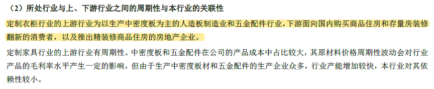

索菲亚用来制造家具的材料主要就是人造板和五金配件。  

关于上下游，我们可以得到以下信息：  

1. 上游行业有周期性，但是好在厂家众多，因此索菲亚选择也很多，总之，上游行业对索菲亚没啥话语权；  
2. 下游有两类消费者，一类是我们这种个人消费者，第二类是房产公司。房产公司属于大客户，自然话语权比较大。  
3. 虽然图中说公司受下游行业周期性影响小，但是，我们要有自己的判断，毕竟房地产是大客户，精装修商品住房是和地产的销售状况息息相关的，公司还是会受到地产行业的影响的。  

### 公司产品或服务怎么卖  

这部分内容一般会出现在公司“**业务概要**”和“**经营情况讨论与分析**”中，或者通过“**销售模式**”，“**销售渠道**”等关键词进行搜索。  

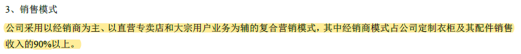

索菲亚的销售模式主要采用**以经销商为主、以直营专卖店和大宗用户业务为辅**的复合营销模式，其中经销商模式占销售收入的90%以上。  

### 公司老板是谁  

年报里不会写谁是老板，一般用的名词是“**实际控制人**”。这部分信息通常出现在“**股东变动及股东情况**”一节里，或者也可以用“**实际控制人**”为关键词进行搜索。  

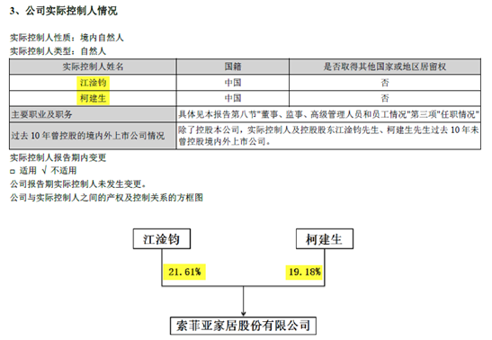

### 分红不分红  

作为公司的股东，我们要关心分红。公司的分红情况一般会出现在“**重要事项**”一节中。同样，以“**分红**”为关键词搜索也能找到相应内容。  

从2014到2016年的数据可见索菲亚历年分红的比例都在50%左右，还算慷慨的。

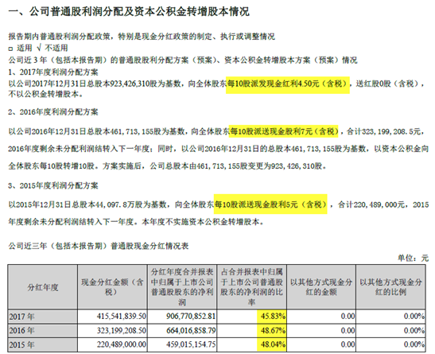

### 公司待遇好不好  

看高管薪酬，目的不是去关心公司给高管们的待遇，按理说，高管们挣多少钱和我们普通股东没啥关系。但是，有些公司就是奉行再苦不能苦领导的政策，甭管底下人怎样勒紧裤带过日子，高管们依然该赚赚该花花。  

比如，公司年利润1000万，高管薪酬800万。如果投资这种公司，中小股东能吃上肉吗？不能，连汤都没得喝！  

我们来看下索菲亚的高管薪酬是何种情况。

高管薪酬一般出现在年报的“**董事、监事、高级管理人员和员工情况**”一节里。我们也可以用“**薪酬**”或者“**高级管理人员**”为关键词搜索找到有关内容。  

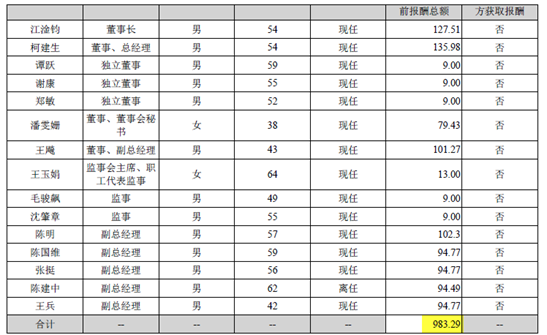

2017年，索菲亚高管薪酬总共983万元，当年索菲亚营业收入61亿，净利润9亿，因此，高管薪酬占净利润比值为1.1%，还是比较合理的。  

### 公司有哪些同行  

在萝卜投研网主页的搜索框输入公司股票名称，在“**综合**”页面可以找到“**同类公司对比**”。  

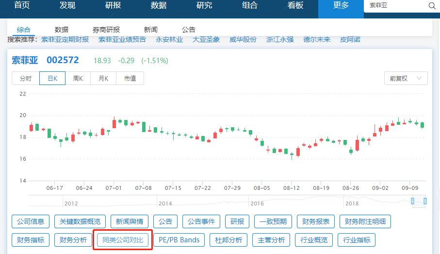

列举出来的公司不一定是同行，我们还需要通过**主营构成**来进一步比较。  

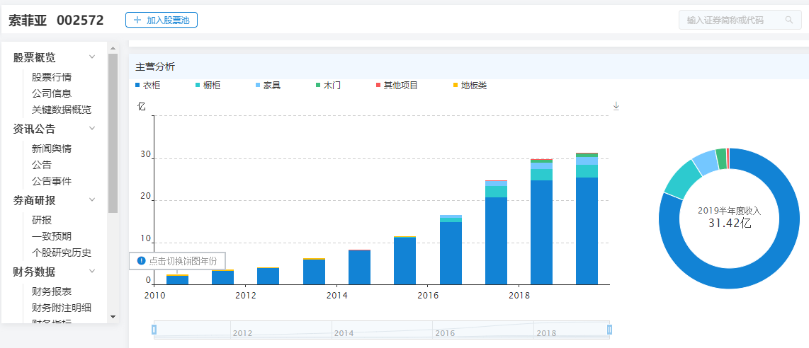

