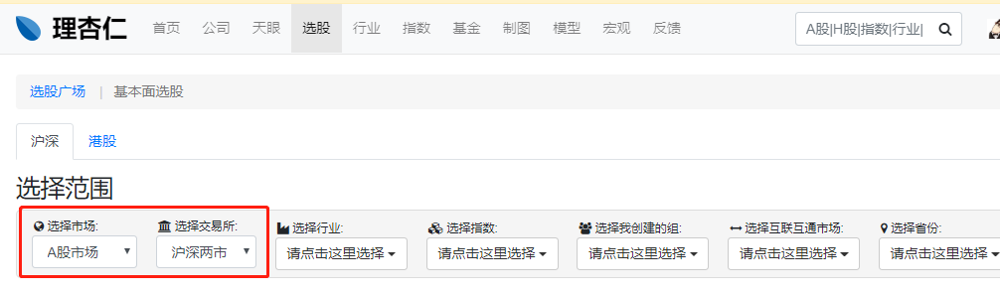
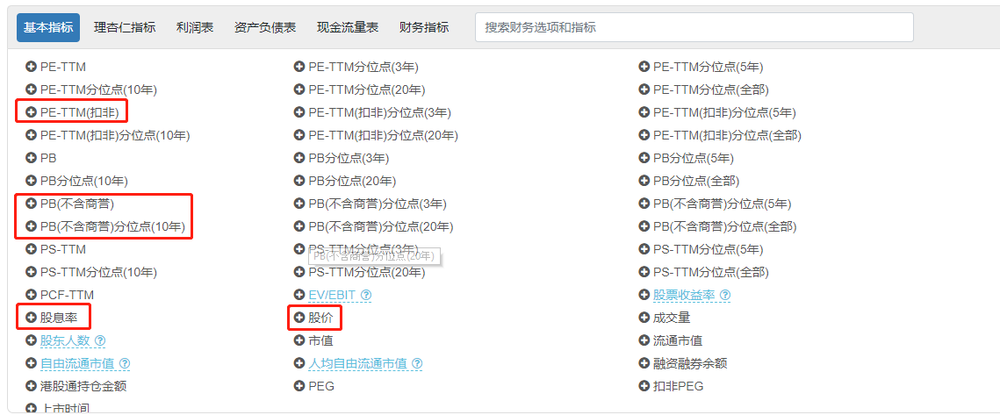
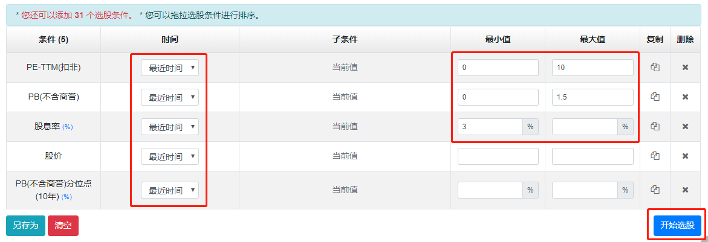
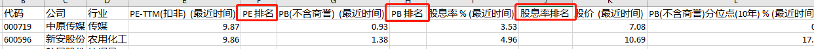
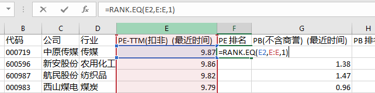
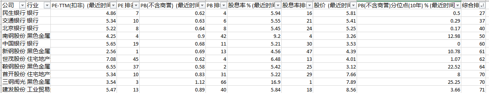
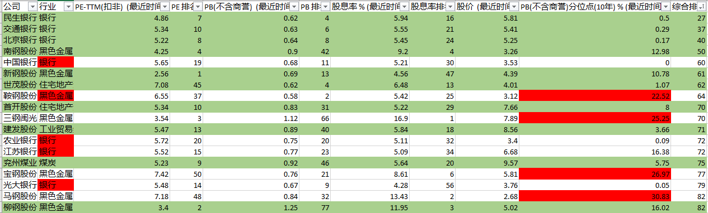
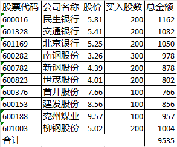

# “捡烟蒂”投资法  

## 0x00 便宜组合  

《投资最重要的事》这边书中，霍华德.马克斯说道。  

> 价格是杰出投资最主要的因素，优秀投资者的目标不只在于“买好的”，也在于“买得好”。  

“捡烟蒂”投资法和“好公司”投资法并不矛盾。“好公司”投资法是寄希望于买现在好未来更好的公司，赚的是业绩提升的钱；“捡烟蒂”投资法是瞅准了那些被低估的股票，未来会回归到正常，赚的是股价回升的钱。  

## 0x01 筛选标准  

```  
0 < PE < 10  
0 < PB < 1.5  
股息率 > 3%  
```

**市盈率和市净率数值越小，说明公司估值越低。**  

**Q：为什么 PE 和 PB 要求大于0？**  

A：PE 小于 0，意味着市盈率为负，公司的亏钱的；PB 小于 0，意味着净资产为负，公司欠的钱太多，卖掉所有资产也抵不了债务。  

**Q：为什么 PE 小于 10，PB 小于 1.5？**  

A：市盈率表示回本年限，小于 10，则说明不到 10 年就能回本；市净率小于 1.5，由于市净率小于 1 的公司太少，所以放宽了 PB 的条件。  

**Q：为什么要加上股息率？**  

A：股息是公司分红，只有公司赚了钱，分红才多。通过这个指标，可以侧面反映了公司经营情况。  

```  
股息率 = 公司过去一年的累计现金分红 / 公司市值  
```

A 股公司平均的股息率约为 3%，筛选条件保持平均水平就好了。  

## 0x02 筛选便宜组合    

- 进入理杏仁网站，“选股” > “基本面选股”；  

- 选择范围，“选择市场” > “A 股市场” ，“选择交易所” > “沪深两市”； 



- 条件设置，选择“基本指标”选项卡，点击选择筛选便宜组合的三个指标；  

  - 市盈率选择 PE-TTM（扣非）  

    扣非：扣除非经常性损益。  

    非经常性损益：在利润表中属于公司利润的一部分，和公司正经经营的业务无关。有些公司，扣非净利润与非扣非净利润的计算结果相差很大。  

  - 不含商誉的 PB  

    商誉：公司收购其他公司时，超过该公司净资产的部分，是公司资产的一部分。  

    商誉本质上并不是真正的资产，所以计算 PB  的时候，把它去掉。  

  - 股息率  

  - 为了后续操作方便，加上两个选股条件：PB（不含商誉）分位点（10年）、股价  



- “时间选择” > “最近时间”；  
- 按照筛选条件，把数值填写到最小值和最大值里面去，点击“开始选股”；  



- 点击“导出 CSV”，导出成 Excel 文件。  

## 0x03 排序筛选法  

### 准备数据  

上一节导出的 Excel 表格作为我们的筛选数据。  

### 排序  

#### 排序法则  

便宜组合的筛选指标：PE、PB、股息率，将这三个指标进行排序，就可以选出便宜组合了。排序法则：    

1. PE、PB 在 Excel 按升序排序，股息率在 Excel 按降序排序。  

2. 3 个指标的排名加总，算出总排名。  

#### Excel 排序技巧  

- 分别在 PE、PB 和股息率之后插入一行“PE 排名”、“PB 排名”和“股息率排名”；  



- 用 **RANK.EQ** 函数计算排名；  

  RANK.EQ 函数中涉及三个部分，数值、引用和排位方式。  

  **数值**：指想要排序的那个数值；  

  **引用**：指要排名的指标的所有数据；  

  **排位方式**：1 代表升序，0 代表降序。  

  *完成第一个单元格的公式以后，将鼠标放在该单元格的右下角，出现黑色十字时，双击鼠标左键可得到所有公司的 PE 排名。*



- 用同样的方法对 PB 和股息率进行排名；  

  *股息率是降序，公式最后的数字改成 0。*

- 添加一列“综合排名”，将 3 个排名相加即可；  

- 对综合排名进行排序，“开始菜单” > “过滤” > “从小到大排序”；  



### 筛选  

- 挑选 8~10 只股票，构建便宜组合；  

- 同行业的公司不超过 30%；

  *如果资金可以投资 10 只股票，按照每个行业不超过 30% 的原则，排名靠前又是同行业的可以挑选 3 只；如果资金只够投资 8 只股票，就只能挑选 2 只。*  

- 用 PB 分位点进一步挑选低估股票。  

  ```  
  分位点 < 20%，表示现在很低估，是个机会；  
  分为点 > 20%，现在比较高估，不适合买入。  
  ```

  *便宜组合大部分是周期股，因为我们看中的是它现在便宜，所以不太挑剔股票的质量，是周期股也没有关系。当时为了让便宜组合更加安全，加上了 PB 分位点这个指标。*

## 0x04 资金分配  

**根据资金量，确定便宜组合的股票数量。**  

以 10 只为例，根据同行业的股票不超过 30% 的原则，每个行业最多跳 3 只。  



**资金均分，确定价格最好的股票买入一手的金额，其余股票的金额往这个金额上靠就可以了。**  

以上面筛选的结果为例，股价最高的是“兖州煤业”，股价为 9.57，计算买入 100 股需要的总金额，然后其余往这个金额上靠就行。其结果为：  

  

**在某个时期筛选便宜组合，筛选出来的股票数量过少不够构建组合或者筛选不出股票，该怎么办？**  

1. 放宽筛选条件  

   比如，PB < 2；PE < 15；股息率 > 2.5%。但是放宽条件，意味着把自己置身于风险之中。  

2. 寻找别的投资机会  

   比如，白马组合，但是白马组合价格会更贵。通常如果筛选不到便宜组合，说明市场比较热，不是入场的好机会，可以买入纯债，因为债券和股票是负相关的关系。  

3. 持币观望，等待入场时机   

   股市投资中，耐心等待是必须要训练的能力。  

## 0x05 被动投资  

便宜组合投资的关键是**被动投资**，**每个半年，重新筛选一次便宜组合，将组合整体估值降低。**  

```  
1. 将最新筛出的组合结果和原来的组合结果对照；  
2. 新旧组合中重合的股票保留；  
3. 卖掉旧组合里有，但新组合里没有的股票；  
4. 补入旧组合里没有，但新组合里有的股票。 
```

## 0x06 总结  

1. 筛选便宜组合的三个指标；  

   ```  
   0 < PE < 10  
   0 < PB < 1.5  
   股息率 > 3
   ```

2. 对三个指标进行综合排名，挑选便宜的股票；  

3. 利用 PB 分位点进一步提出相对“贵”的股票；  

4. 挑选 8~10 只股票，资产均分；  

5. 半年调一次仓。  

     

**用 PB 分位点