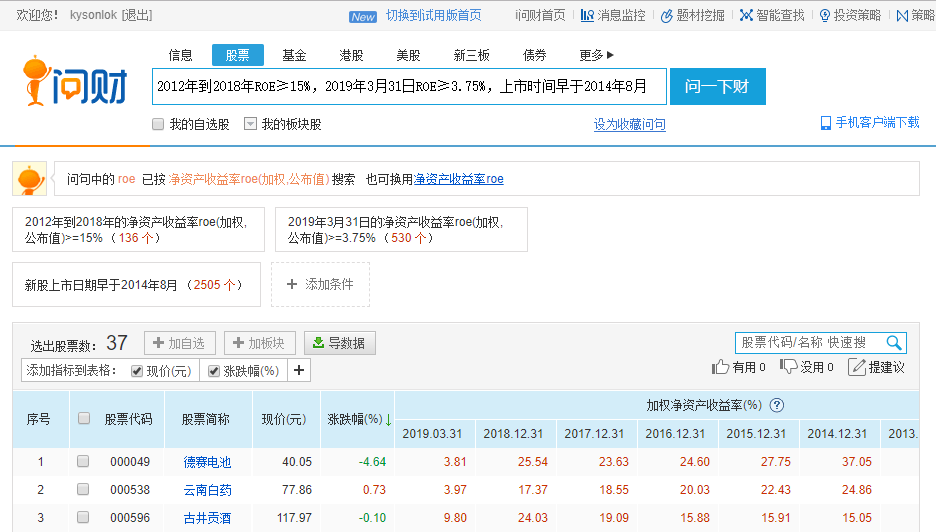
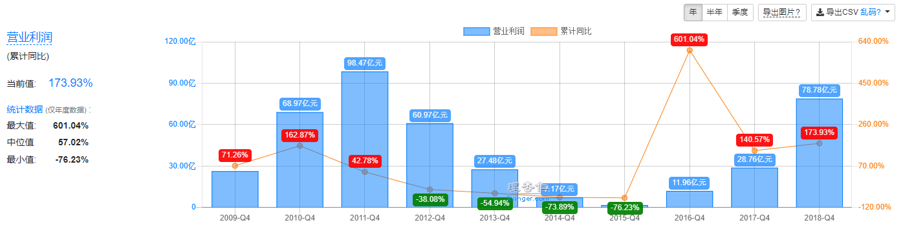
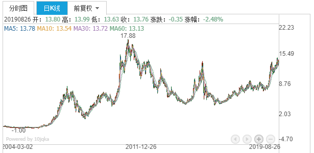
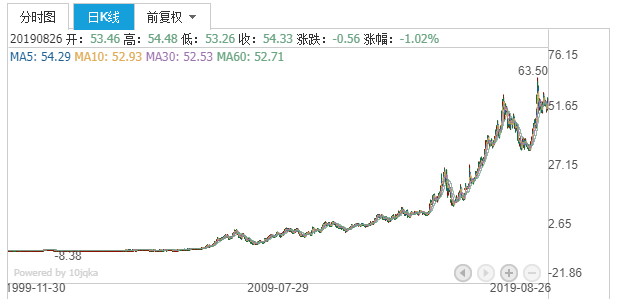
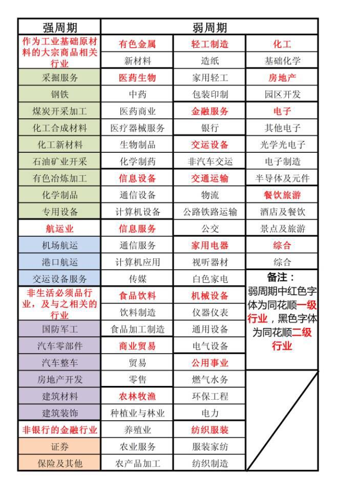
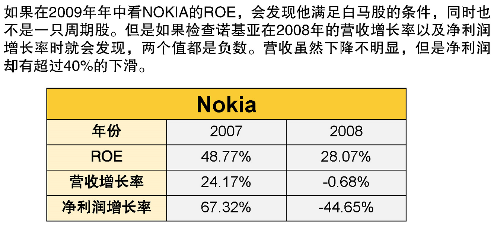

# “好公司”投资法  

## 初筛白马股  

### 什么是好股票  

我们头脑要保持清晰，理性看待价格上涨下跌。近期的价格大幅上涨，有可能是好的表现，也有可能是被人炒作过热。2015年的暴风集团就一个例子。  

Q：黑马股是不是好股？  

A：这个不好说，黑马股是本来不被看好，却出乎意料地在短期大幅上涨。至于为什么不被看好，是有原因的。我们不能确定选中的是黑马，还是黑猪。  

**白马股**才是我们投资者的目标，它具有**投资回报率高**、**长期业绩优秀**、**信息相对可靠**三大特点。  

### 什么是投资回报率  

**投资多少能赚多少的比例，就是投资回报率**。  

> 二狗有两个朋友，分别开了一家奶茶店和一家糖果店。他们都想找二狗投资。  
>
> 奶茶店装修高大上，生意火爆，每年投入10万元，扣除所有费用支出最终净赚5万。  
>
> 糖果店人流差些，装修普通，每年投入10万元，扣除所有费用支出最终净赚7万。
>
> 
>
> 奶茶店一年的投资回报率是：5万/10万 = 50%  
>
> 糖果店一年的投资回报率是：7万/10万 = 70%  
>
> 
>
> 二狗当然会选糖果店。  

一只股票的投资回报率又叫**投资收益率**。  

`一只股票的投资回报率（投资的钱所赚钱的比率） = （卖出价格/买入价格 - 1）* 100%`  

> 在2016年1月27日，15元的价格买入格力电器的股票  
>
> 到2018年1月26日，57元的价格卖出  
>
> 投资收益率 = （57/15 - 1）* 100% = 280%  

如果计算到每年的话，就是：  

`年化复合收益率 = [(卖出价格/买入价格)^(1/n)-1] * 100%`，其中n=投资年限  

> 格力电器投资两年的年化复合收益率 = [(57/15)^(1/2) - 1] * 100% = 95%  

### 投资回报率怎么看  

`净资产收益率（ROE）= 净利润/净资产`  

代表企业用一元钱的净资产能顾赚取多少净利润，也就是带来多少投资回报，代表了企业的赚钱能力。  

### ROE和股票投资收益率的关系  

| 公司               | 贵州茅台 | 格力电器 | 云南白药 | 信隆健康 |
| ------------------ | -------- | -------- | -------- | -------- |
| 十年复合年化收益率 | 32.91%   | 27.04%   | 20.46%   | 8.80%    |
| 十年平均ROE        | 34.38%   | 33.19%   | 23.41%   | 3.78%    |

如果长期持有一只股票，你的年化复合收益率和企业的净资产收益率是成正相关的关系，因此我们用ROE作为择股的指标。  

**ROE越高，股票的年化收益率就越高。**  

### 组合里的股票怎么选  

筛选白马股的条件：**ROE连续7年≥15%**，因为7年经历了一个完整牛熊周期。  

寻马神器——“i问财” https://www.iwencai.com  

以2019年08月25号为时间节点，筛选白马股步骤：  

1. 进入“i问财”主页，登录；  

2. 在搜索框输入“2012年到2018年ROE≥15%，2019年3月31日ROE≥3.75%，上市时间早于2014年8月”，点击“问一下财”；  

3. 搜索结果就是我们初步筛选出来的白马股。  

     

**Q：为何要加上“2019年3月31日ROE≥3.75%”这个条件呢？**  

A：因为搜索时间是2019年8月25日，2019年已经度过了一个季度，我们要把这一季度的业绩也考虑进去。而一年收益率大于等于15%，平均每个季度就是15%/4 = 3.75%。同理，如果过了两个季度，就是15%/4*2 = 7.5%。  

**Q：为何要加上“上市时间早于2014年8月”这个条件呢？**  

A：只有满足**上市时间大于5年**才能被纳入我们的考虑范围。有些公司在上市之前ROE成绩不错，符合“2012年到2018年ROE≥15%”这个条件，但是上市时间过短的话，公司业绩不够稳定，故不采纳。  

```  
关于财报披露时间，有个口诀方便记忆。

第一季度结束后一个月内公布（4月1日~4月31日），  
第二季度结束后两个月内公布（7月1日~8月31日），  
第三季度结束后一个月内公布（10月1日~10月31日），  
第四季度即年报是结束后四个月内公布（下一年的1月1日~4月30日）。  

就是1214，就像军训喊的口号：121，是！ 
```

### 如何判断一个公司是否满足白马股  

如果我们看中一只股票，想了解它是不是满足白马股条件，可以在 [理杏仁](https://www.lixinger.com) 查询。在理杏仁主页的搜索框中输入公司名称，搜索后点击“盈利分析”，就可以看到公司的ROE图了。  

点选“10年” > “年”，就能很方便地看该公司过去10年的ROE数值，从而判断出它是不是一只白马股。  

## 剔除周期股  

### 什么是经济周期  

经济周期就是国民经济呈现扩张与紧缩交替的波动变化。这种变化具有必然发生和循环往复的特点，因此形成了经济波动。  

将经济周期分为四阶段：繁荣、衰退、萧条、复苏。A-B为衰退， B-C为萧条,，C-D为复苏，　D-E为繁荣。  


把经济发展看做四季的单曲循环，就变成了春天复苏、夏天繁荣、秋天衰退和冬天萧条，之后重新回到复苏的春天。  

### 什么是周期股  

公司所处行业不同，受经济周期影响的程度也大相径庭。  

以“三一重工”为例，我们可以在 [理杏仁](https://www.lixinger.com/) 搜索该股票，在 “基本面” > “成长分析” 可以看到营业利润。下图可知，经济环境好的时候，2011年，可以赚98.47亿；经济环境不好的时候，2015年，只有1.71亿的利润。  



我们再来看一下“三一重工”的股票情况，在 [i问财](https://www.iwencai.com/) 搜索“三一重工”，看它的k线图，呈大幅波动。2011年4月11日，最高点18.86元；2015年大牛市也没有涨回；2019年8月23日，收盘价13.76元。



再对比一下“格力电器”的股票情况，格力电器就显得比较平稳。  



**周期性行业：**业绩紧跟着经济周期起起伏伏，繁荣时赚得盆满钵满，萧条时业绩一落千丈。  

**非周期性行业：**受经济周期的影响较小，经营业绩较为稳定。    

对于新手的我们，要避开周期股，当然啦，我们能抓住周期股的衰退期买入，繁荣期卖出，也是挺不错的，但这需要我们具备分析行业的能力，继续学习吧，先赚自己能力圈的钱。  

### 剔除周期股  

通过判断所处行业是不是周期性行业，就能知道这个股票是不是周期股。在证券市场，“行业”有着成熟的分类。我们可以在 [同花顺行业](http://q.10jqka.com.cn/thshy/) 看到所有二级行业的分类，目前有66种。根据以下表格剔除周期股：   



### 实操  

在前面筛选白马股的条件中，加上“行业”，就会把股票所属行业也显示出来。  

以2019年08月25号为时间节点，筛选步骤：  

1. 进入“i问财”主页，登录；  
2. 在搜索框输入“2012年到2018年ROE≥15%，2019年3月31日ROE≥3.75%，上市时间早于2014年8月，行业”，点击“问一下财”；  
3. 去掉不需要显示的数据，如“净利润”、“动态市盈率”等，导出搜索结果；  
4. 用Excel打开数据，找到所属行业一栏，把周期性行业的股票删除。  

## 剔除基本面转坏的股票  

### 四个指标判断业绩下滑  

**历史数据筛选出来的好公司只能确定它曾经有过优异的表现，但不代表它的未来盈利也是乐观的。**曾经风光无限的诺基亚，在短短的几年就销声匿迹了，我们新手要如何避开这类公司呢？咱们通过四个指标判断公司业绩是否有下滑的迹象。  

- 季度营收增长率  
- 季度净利润增长率  
- 年度营收增长率  
- 年度净利润增长率  

我们都知道 `收入 - 支出 = 净利润`。今年的营业收入和净利润 > 去年，说明今年的生意越来越好；今年的营业收入和净利润 < 去年，说明今年的生意不如去年。  

因此，想要知道白马股的业绩是否有下滑迹象，只要比较公司当前和过去的营业收入和净利润就可以啦。  

上市公司除了有年报，还有季报，为了能及时了解公司的业绩变化，还可以比较本季度和去年同季度的业绩。  

```  
年度营收增长率 = （本年的营业收入 - 去年的营业收入）/ 去年的营业收入  
年度净利润增长率 = （本年的净利润 - 去年的净利润）/ 去年的净利润  
季度营收增长率 = （本季度的营业收入 - 去年同季度的营业收入）/ 去年同季度的营业收入  
季度净利润增长率 = （本季度的净利润 - 去年同季度的净利润）/ 去年同季度的净利润
```

剔除条件是**四个指标中有任意一个是负数，就从组合中剔除**。  



### 实操  

在前面的条件中，再加上“营收增长率”和“净利润增长率”。  

以2019年08月25号为时间节点，筛选步骤：  

1. 进入“i问财”主页，登录；  
2. 在搜索框输入“2012年到2018年ROE≥15%，2019年3月31日ROE≥3.75%，上市时间早于2014年8月，行业，2019年3月31日营收增长率，2019年3月31日净利润增长率，2018年营收增长率，2018年净利润增长率”，点击“问一下财”；  
3. 去掉不需要显示的数据，如“净利润”、“动态市盈率”等，导出搜索结果；  
4. 用Excel打开数据，找到所属行业一栏，把周期性行业的股票删除；  
5. 把出现业绩下滑（4个指标中有一个为负数）的公司删除。  