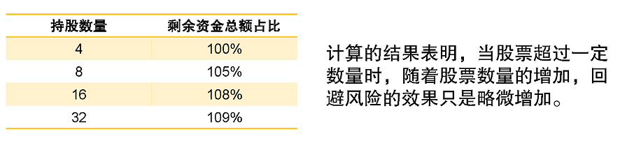
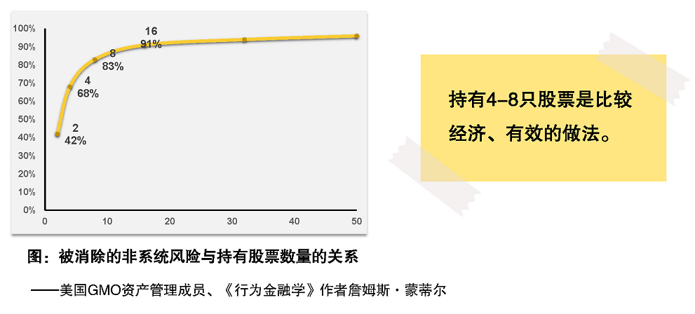
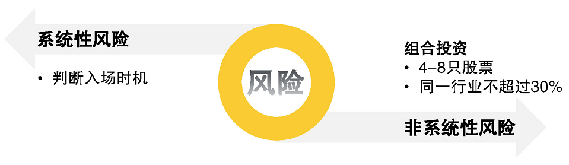

# 合理规避风险  

## 股市风险  

股市的风险分为两大类，分别是**系统性风险**和**非系统性风险**。  

### 系统性风险  

系统性风险指的是整个股票市场存在的下跌风险，包含：  

1. 政策风险  

   政策改变导致企业生存条件变化，可能是好的变化，也可能是不好的变化。  

2. 购买力风险  

   就是通货膨胀风险，手里的钱越来越不值钱。  

3. 利率风险  

   市场利率会不断波动。  

想要回避系统性风险，围观而不参与千股大跌的大场面，根据前面学习到的先估值再入市是一个有效的方法。在市场整体**估值比较便宜的时候进场**，而在市场整体**估值比较贵的时候离开**。  

### 非系统性风险  

非系统性风险指的是单只股票本身的风险，包含：  

1. 经营风险  

   公司经营的错误决策可能导致公司业绩大幅下滑，例如曾经的手机行业老大“诺基亚”。  

2. 信用风险  

   公司违背信用所产生的风险。  

3. 道德风险  

   违背道德事件，例如三鹿“毒奶粉事件”。  

想要规避非系统性风险，我需要构建投资组合，把资金分散到多个行业的多只股票上，所谓“鸡蛋不要放到一个篮子里，篮子不要放到一辆车子里”嘛。  

不信？咱们来看个例子。  

> 1000元买入“要减肥”股票 -> 亏损30%  
>
> 资金总额：1000 * (1 - 30%) = 700元  
>
>   
>
> 1000元平均买入两只股票。  
>
> 500元买入“要减肥”股票 -> 亏损30%  
>
> 500元买入“要变美”股票 -> 盈利10%  
>
> 资金总额：500 * (1 - 30%) + 500 * (1 + 30%) = 900元  
>
>   
>
> 仅仅多买了一只股票，居然少亏损 20% ((900 - 700) / 1000 = 20%)。

## 投资组合  

### 组合中多少只股票合适  

回避风险时，不是买的股票越多就越科学，我们来看一组数据。  

假如买入一系列股票，只有“要减肥”股票遭受了意外事件，亏损30%，其余保持10%的盈利。  

既然随着股票数量的增大，规避风险的效果只是略微增大，而且过多的股票管理所需的时间、精力大大增加，操作误差可能性增大，那么我们**选4~8只股票投资**就可以了。    

### 组合里有多少行业合适  

因为在不同的时间，我们筛选出来的行业数目是不同的，不能死板地按照多少个行业和每个行业多少只股票来分配资产，而是遵循**同行业的资金占比不要超过30%**法则。  

回顾2008年“毒奶粉”事件，蒙牛乳业、伊利股份、光明乳业和三元股份的股票都受到影响，如果股票组合集中在乳制品行业，就算分散买了4只，在当时行业丑闻的冲击下，还是会遭受巨大的亏损。  

因此，控制单个行业股票在投资组合中的资金占比，才能有效减少行业风险。  

## 总结  

