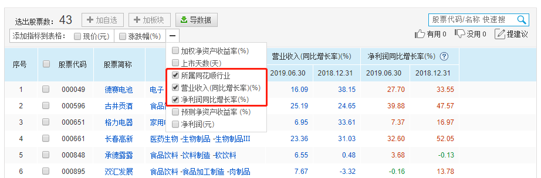
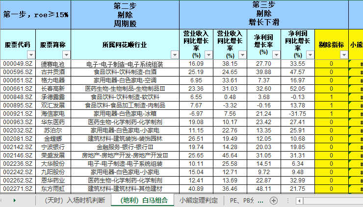
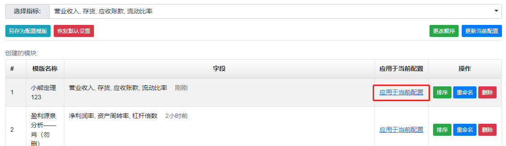
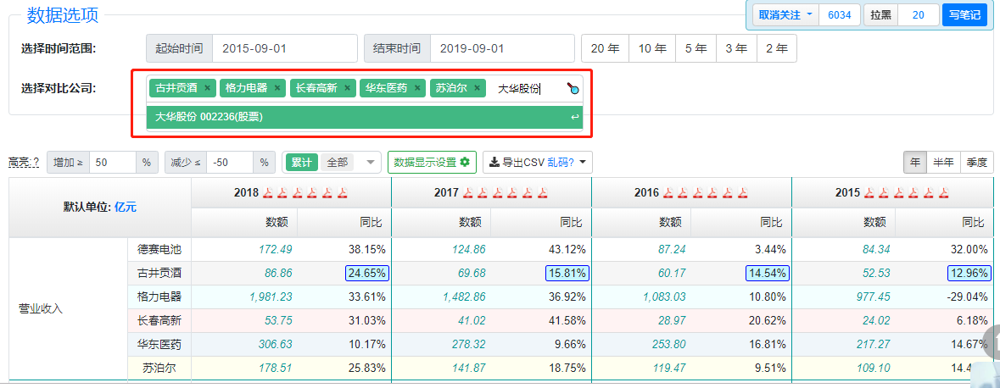
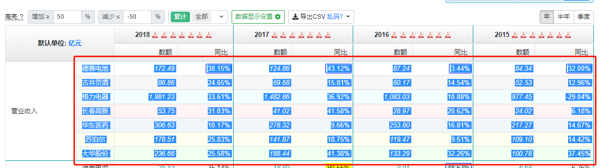
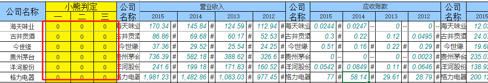

# 构建白马组合  

## 写在前面  

经过前面的学习，我们已经学会怎么筛选白马组合，筛选指标比较多，A 股市场有几千只股票，筛选出的待定白马股也有几十只，一个一个地用小熊三大定理来验证岂不是累成狗？本文就是借助理杏仁网站和 Excel 快速筛选白马组合。  

咱们先下载实操表 [白马股筛选实操表.xls](./files/白马股筛选实操表.xls)，跟着一起来实操。  

## 判断入场时机  

首先，我们判断入场时机。如果股市现在太“热”，就不适合入场，除非你想当炮灰，不适合入场就不用后面的筛选操作了，持币观望，或者寻找其他投资机会。  

打开我们的 Excel 表格，第一个表格就是判断入场时机。只要我们从理杏仁中查询出沪深 300、中证 500 的 PE 和 PB 数据，分别找出 PE 和 PB 的当前分位点，然后填写到表格对应的单元格，实操表就可以帮我们得出结论。  

以 2019 年 09 月 01 为例，结果是适合入场。  


## 筛选白马组合  

### 四步挑选白马王子  

接下来，我们要开始筛选白马组合了，有以下四个大步骤。  

```  
第一步，筛选出ROE连续7年大于等于15%的公司。
第二步，剔除周期股。
第三步，剔除基本面可能转坏的股票。
第四步，看是否通过小熊三定理验证。
```

前面三步需要用到的工具是 [i问财](https://www.iwencai.com/)，第四步用到的是 [理杏仁](https://www.lixinger.com/)，我们以 2019 年 09 月 01 日为例，进行筛选。

### 前三步的筛选条件  

我们先来看前面三步需要哪些数据。  

第一个步骤很容易，只要有 ROE 数据就可以了。  

如果我们在 2019 年 09 月 01 日这个时间节点来筛选白马股，满足连续 7 年 ROE 大于等于 15% 的年份就应该是 2012 年 - 2018 年。  

考虑到 2019 年 09 月 01 日的时候，2019 年的第二季报都已经出了，所以，我们还需要加上 2019 年 2 季度的 ROE 大于等于7.5（15/4*2=7.5）这一条。  

当然，别忘记我们还要把上市时间不满 5 年的公司排除。  

因此，在 i问财中，我们需要输入的是“**2012年到2018年ROE≥15%，2019年6月31日ROE≥7.5%，上市时间大于5年**”。  

第二个步骤，剔除周期股，我们依靠公司所处行业来判断，因此，在 i问财搜索中我们需要加上“**行业**”，把行业信息带出来。  

第三个步骤，剔除基本面可能转坏的股票。  

我们需要通过前一年，也就是 2018 年和当年最近季度，也就是2019 年 2 季度的营收增长率与净利润增长率是否下滑来判断。  

在 i问财搜索中我们需要加上“**2018年营收增长率，2018年净利润增长率，2019年6月31日营收增长率，2019年6月31日净利润增长率**“，把去年和当年第二季度的营收增长率和净利润增长率的信息带出来。  

### 实操环节  

好了，理论部分已经讲完了，下面进入操作部分。  

#### 获取数据  

进入 i问财首页，在搜索框输入“2012年到2018年ROE≥15%，2019年6月31日ROE≥7.5%，上市时间大于5年，行业，2018年营收增长率，2018年净利润增长率，2019年6月31日营收增长率，2019年6月31日净利润增长率”，点击“问一下财”。 

第二步，在搜索框输入“**2012年到2018年ROE≥15%，2019年6月31日ROE≥7.5%，上市时间大于5年，行业，2018年营收增长率，2018年净利润增长率，2019年6月31日营收增长率，2019年6月31日净利润增长率**”，点击“问一下财”。 


选择我们需要的数据导出，只需要勾选“所属同花顺行业”、“营业收入(同比增长率)(%)”、“净利润同比增长率(%)”这三个指标，其他勾选的全部取消，点击“导数据”。   

  

Excel 打开导出来的数据，把除第一行以外的全部数据复制，粘贴到实操表的【(地利)白马组合】表格中，画风大致是这样子：  



#### 剔除周期股  

有了 roe≥15% 的股票以及基础数据，我们继续筛选白马股的第二步，剔除周期股。点击“所属同花顺行业”边上的小三角，看“所属同花顺行业”中间那个（二级行业），对照下面表格的强周期二级行业，把属于强周期的行业股票去掉。  

*由于银行的特殊性，不能用小熊定理检验，为了后面的操作方便，暂时把银行也去掉，筛选完成之后再放出来。*   


#### 剔除基本面转坏的公司  

最近的年度营收增长率和净利润增长率，最近的季度营收增长率和净利润增长率，这 4 个指标中只要有一个小于 0 就说明基本面可能转坏，需要被剔除。  

表格内置了公式自动帮我们算出来是否要剔除，所以我们只要把“剔除指标”列数值为 1 过滤掉就好。 


#### 用小熊三大定理验身  

经过过六关斩六将，终于来到了用小熊三大定理给公司验身部分了。  

通过前面的学习，我们知道小熊定理需要计算好几个数据，现在筛选剩余几十家公司，这得算多久啊！别慌，我们有技巧。  

只要在【小熊定理判定】表格中输入每家公司的营业收入、应收帐款、存货、流动比率数据，【(地利)白马组合】表格中就会自动显示结果！“0” 代表可以通过小熊定理的检验，“NO” 代表无法通过小熊定理的检验。具体如何操作呢？  

首先，我们复制筛选后剩余的所有公司的公司名称到【小熊定理判定】表格中；  

然后我们以“海天味业”为例，说明如何使用【小熊定理判定】表；  

在理杏仁中搜索“海天味业”，进入“自定义财报”页面，点击下面的“数据显示设置”，进入设置页面。  


点击“选择指标”旁边的输入框，再选择“清空”。  


点击“利润表”选项卡，勾上“营业收入”；在点击“资产负债表”选项卡，勾上“应收账款’‘、“存货”、“流动比率”。  


点击“确定”，接着点击“另存为配置模板”，名称随便写就好。存好之后点击“应用于当前配置”。  



现在，只显示我们要的数据啦。因为小熊定理比较的是近 4 年的数据，因此时间选择 2015 - 2019，时间单位选择“年”。    


在搜索公司的地方依次输入其他 6 家公司（因为理杏仁限制了最多只能对比 6 家公司，所以我们要分批操作）。然后分别把“营业收入”、“存货”、“应收账款”、“流动比率”复制到实操表的【小熊定理判定】表格中。    

*搜索时最好是按照 Excel 【小熊定理判定】表格的顺序来，因为我们要把 6 家公司整体复制到表格中的，没别的目的，就是为了操作快。*  





按照这个方法，把剩余公司的数据都筛选出来并且复制到实操表中就可以了。  

有人会疑惑 Excel 表格的**数据是“#”，“--”，“######”或者“#VALUE!”都是什么意思**？    


“#”和“######”，表示单元格宽度不够，把单元格拉长一点就好了；  

**“--”，表示数值为 0，计算时我们需要手动把 “--”改成 0，否则计算出错；**  

**“#VALUE!”，表示计算出错了，因为理杏仁的单位默认是“亿”，有些数据用“万”表示，我们需要手动把它们改成以“亿”为单位。**  

修改后，正确的显示长这样子：  



不满足小熊定理的，会显示“NO”，全部数据都处理完以后，回到【(地利)白马组合】表格，过滤掉小熊三大定理中任意一定理为“NO”的股票。  

#### PE 和 PB 分位点  

最后一步，剔除 PE 或 PB 任何一个分位点超过 50% 的股票。  

直接在理杏仁网站找对应的股票，在“基本面”页面，找到PE-TTM(扣非)和PB(不含商誉)，把当前 PE 和 PB 分位点记录到实操表的【PE、PB分位点】表格。  

有 20 几个待选白马股，难道要一个一个搜索吗？岂不是累成狗？  

不，鸡贼小技巧走起~  

进入理杏仁首页，选择“选股”，点击“基本面选股”，选择“A 股市场”。步骤很像筛选便宜组合，有木有？没错，就是一样的。  


我们选择条件设置，选择“PE-TTM(扣非)分位点(10年)”和“PB(不含商誉)分位点(10年)”。  


时间选择选股当天的日期，这里是以 2019 年 09 月 01 日为例，因此时间选择2019 年 09 月 01 日，然后点击“开始选股”。  


找到 3000 多个结果，点击“导出CSV”。用 Excel 打开，复制除第一行以外剩余的数据，拷贝到实操表的【PE、PB分位点】表格中，画风大致是这样的：  


回到【(地利)白马组合】表格，PE 和 PB 分位点自动填充进来了，我们再将 PE 分位点和 PB 分位点按数字过滤，把大于 50% 的股票过滤掉。剩余的数据，就是最终的白马组合。  

PE 分为点按照升序排序，根据同行业不超过 30% 的原则，构建我们的白马组合。  

记得哦，组合选 4~8 只就好了。  

