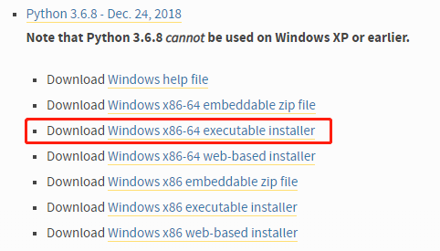
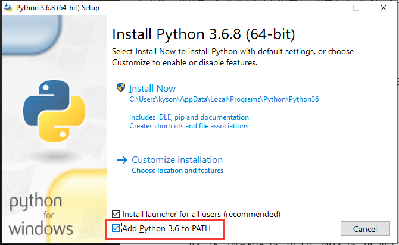
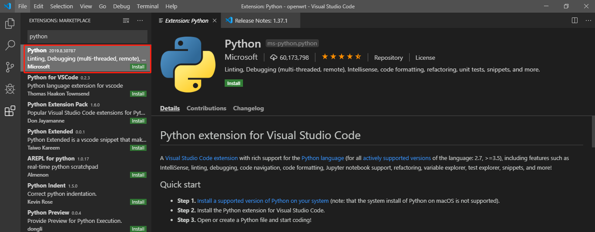
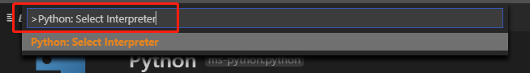
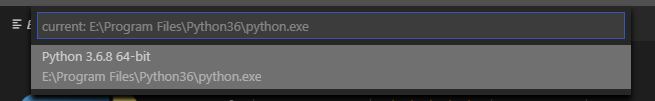
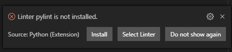
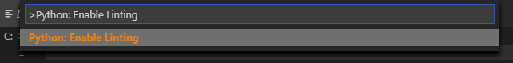
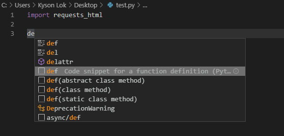
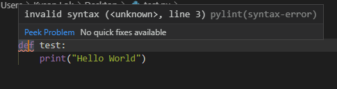

# Python in Visual studio Code

## 0x00 写在前面  

工欲善其事必先利其器，在开始学习 Python 之前，我们先把开发环境搭建好。  

但是市面上有各种各样的 IDE，挑到眼花缭乱怎么办？那就跟着自己的感觉走，由于在 Windows 上我更加倾向于使用 Visual studio Code 写代码，因此把 Python 解析器集成到 Visual studio Code 就好了。  

## 0x01 安装 Python  

### 下载  

安装 Python 很简单，下载 Python 安装包，直接无脑式安装就行。  

直接进入 [Python 下载](https://www.python.org/downloads/windows/) 页面，找到合适的版本，然后点击标题带有 executable installer 的链接就会直接下载。64 位操作系统，以 Python 3.6.8 为例：  



### 安装  

下载好以后，直接安装即可，要注意把 Python 的安装路径添加到 **PATH** 系统环境变量，为了方便在 **CMD** 可以直接执行 Python 解析器。  



### 验证  

好了，安装成功后，我们进入 **CMD** 验证一下，我这里用的是 **Cmder** 终端模拟器，不过没关系，都一样的。分别执行 `python --version` 和 `pip --version`，只要正确显示它们的版本号就说明安装成功了。  

```  
C:\Users\Kyson Lok\Desktop
λ python --version
Python 3.6.8

C:\Users\Kyson Lok\Desktop
λ pip --version
pip 18.1 from e:\program files\python36\lib\site-packages\pip (python 3.6)
```

## 0x02 配置 Visual studio Code  

### 安装 Python 插件  

关于 Visual studio Code 的 Python 插件详细指导，可以参考 [install the extension from the VS Code marketplace](https://marketplace.visualstudio.com/items?itemName=ms-python.python)。直接在 Visual studio Code 的插件页面搜索 Python，安装下面这个插件就行。  



### 配置 Python 解析器  

安装 Python 插件后，接下来就是告诉它我们的解析器在哪，好让它要用的的时候能找到。  

按住 `Ctrl+Shift+P` 组合键打开命令面板，然后在查找框输入 **Python: Select Interpreter**，就能找到 Python 解析器配置命令。执行该命令会在我们的系统环境变量查找 Python 解析器的路径，把所有结果都列举出来。如果安装了多个版本的话，选择自己要的就好。  





### 安装 Linter  

Linter 可以帮助我们识别和纠正代码语法错误和规范编码风格，总之是比较好用就是了。  

按住 `Ctrl+Shift+P` 组合键打开命令面板，在查找框输入 **Python: Select Linter**，执行该命令，有好几种 Linter 供我们选择，我选的是 **pylint**，选完会提示我安装 pylint，直接安装即可。   



其实也可以用 **pip** 直接安装，对应的命令 `pip install pylint`。  

接下来我们还需要把 Linting 功能打开，在命令面板执行 **Python: Enable Linting**，选择 **on**。  



最后，创建个 py 文件，测试下有没有自动补全以及错误语法检查。  





至此，我们的环境搭建完成，接下来就可以开启 Python 之旅了。好的工具让开发更有效率，就像武功盖世的英雄用最好的武器一样。

## 0x03 附录  

https://code.visualstudio.com/docs/languages/python  
