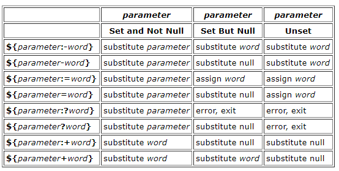

## shell参数扩展说明

shell 参数扩展格式：  

```  
${expression}
``` 

expression表达式可以为任意的字符，直到匹配到'}'为止，因此表达式包含'}'的话需要用转义或者用单引号包含起来。

## 值替换  

```  
${parameter:-word}
如果parameter为null或者未设置，整个参数替换表达式值为word
 
${parameter:=word}
如果parameter为null或者未设置，整个参数替换表达式值为word，并且parameter参数值设置为word
 
${parameter:?word}
如果parameter为null或者未设置，则打印出错误信息。否则，整个参数替换表达式值为$parameter
 
${parameter:+word}
如果parameter不为null或者未设置，则整个参数替换表达式值为word
```  

<div style="text-align:center"></div>

## 字符串替换  

```  
${parameter/pattern/string}
${parameter//pattern/string}
将parameter对应值的pattern字符串替换成为string字符串
/表示只替换一次
//表示全部替换
```  

## 字符串长度  

```  
${#parameter}
获得字符串的长度
```  

## 字符过滤  

```  
${parameter%word}
${parameter%%word}
word支持通配符，从尾开始匹配word，将匹配word正则表达式的字符删除
%为最短匹配，%%为最长匹配
 
${parameter#word}
${parameter##word}
word支持通配符，从头开始扫描word，将匹配word正则表达的字符删除
#为最短匹配，##为最长匹配

注意，匹配成功就停止继续匹配，也就是只匹配一次。最长匹配一般是针对通配符，能够匹配到最长字符串，也就是即时匹配成功，还会继续匹配，取最后一次匹配成功的。
```  

### Examples

```  
${parameter%word}

x=file.c
echo ${x%.c}.o
file.o

${parameter%%word}

x=posix/src/std
echo ${x%%/*}
posix

${parameter#word}

x=$HOME/src/cmd
echo ${x#$HOME}
/src/cmd

${parameter##word}

x=/one/two/three
echo ${x##*/}
three
```  

## See also  

http://pubs.opengroup.org/onlinepubs/009695399/utilities/xcu_chap02.html#tag_02_06_02
