## 安装  

- 从[https://code.visualstudio.com](https://code.visualstudio.com)下载Visual Studio Code，并安装；  

- 安装C/C++插件；  

  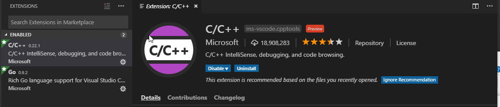  

- 安装Go插件。  

  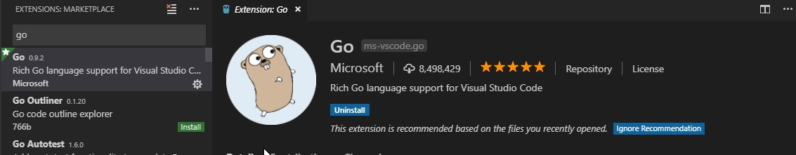  

## 开始    

### 快捷键  

**注意，快捷键可能会跟别的应用程序冲突，如果有冲突，需要重新自定义。**  

#### 快捷键总览  

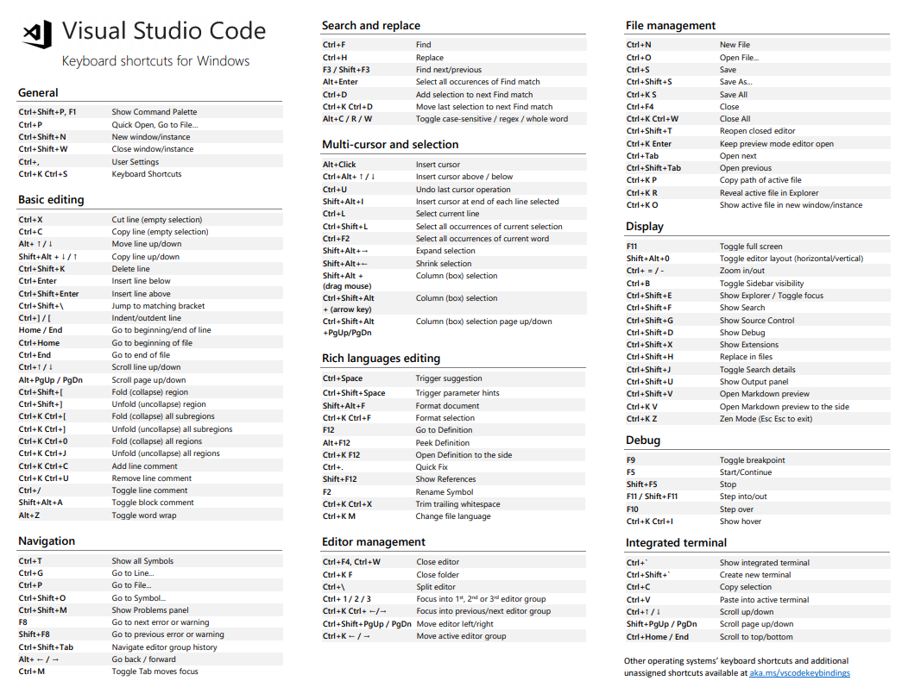  

#### 常规快捷键  

命令面板：<code>Ctrl + Shift + P</code>, <code>F1</code>  

Keyboard Shortcuts：<code>Ctrl + K Ctrl + S</code>  

打开命令行终端：<code>Ctrl + `</code>  

#### 导航快捷键  

快速打开文件：<code>Ctrl + P</code>  

关闭当前文件：<code>Ctrl + F4</code>  

跳转到实现：<code>F12</code>  

跳转到声明：<code>Ctrl + F12</code>  

后退：<code>Alt + **&larr;**</code>  

前进：<code>Alt + **&rarr;**</code>  

鼠标上滚动：<code>Ctrl + **&uarr;**</code>  

鼠标下滚动：<code>Ctrl + **&darr;**</code>  

符号索引：<code>Ctrl + Shift + O</code>  

#### 查找快捷键  

当前文件查找：<code>Ctrl + F</code>  

查找下一个：<code>F3</code>  

查找上一个：<code>Shift + F3</code>  

## 集成cmder  

### 快捷键冲突  

**注意，VSCode打开命令行终端的快捷 <code>Ctrl + `</code> 跟cmder的快捷有冲突。因此，要先修改cmder的快捷键。**  

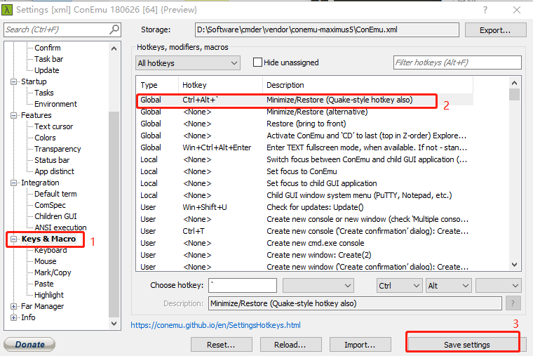  

### 配置

1. 按下`Ctrl + ,`快捷键，快速打开VSCode配置；  

2. 搜索`settings.json`；  

   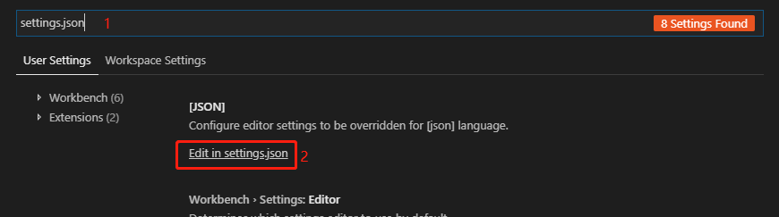

3. 粘贴以下的变量信息到配置文件中：  

   ```  
   "terminal.integrated.shell.windows": "cmd.exe",
   "terminal.integrated.env.windows": {
       "CMDER_ROOT": "[cmder_root]"
   },
   "terminal.integrated.shellArgs.windows": [
       "/k [cmder_root]\\vendor\\init.bat"
   ]
   ```

   将`[cmder_root]`替换成**cmder**的根路径，**注意，反斜杠路径要加转义（即双斜杠表示斜杠），！！！路径不要包含空格**；  

4. 重启VSCode让其生效，按下<code>Ctrl + `</code>快捷键，打开VSCode命令行终端。  

   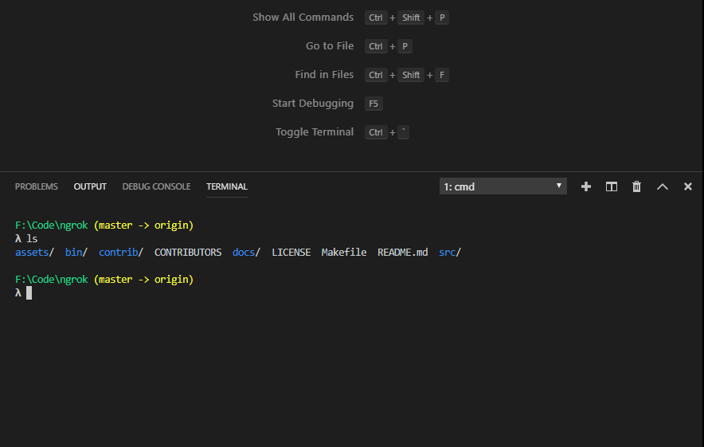  

## Go开发环境  

### 安装Go  

从[https://golang.org](https://golang.org/)下载Go管理工具，并安装；安装完成以后，会自动添加系统环境变量**GOROOT**和用户环境变量**GOPATH**（存放Go源码和二进制的路径，跟**Linux /usr/lib**存放库类似），可以执行`go env`查看go所有变量；  

### 安装插件  

为了方便开发，我们需要安装这些插件`gocode, gopkgs, go-outline, go-symbols, guru, gorename, dlv, godef, goreturns, golint`，但是直接在VSCode安装插件不成功，所以需要在`cmd`上面手动安装，稍微有点麻烦。编译/安装过程import找不到包，一般就是`git clone`对应的包到对应的目录，然后重新安装就行了。  

执行`go env`查看一下**GOPATH**的路径，然后切换到**$GOPATH/src/github.com**。**提示：没有src/github.com 目录的话就手动创建**。clone以下源码：  

```  
git clone https://github.com/mdempsky/gocode.git mdempsky/gocode
git clone https://github.com/karrick/godirwalk.git karrick/godirwalk
git clone https://github.com/pkg/errors.git pkg/errors
git clone https://github.com/uudashr/gopkgs.git uudashr/gopkgs
git clone https://github.com/lukehoban/go-find-references.git lukehoban/go-find-references
git clone https://github.com/lukehoban/ident.git lukehoban/ident
git clone https://github.com/ramya-rao-a/go-outline.git ramya-rao-a/go-outline
git clone https://github.com/acroca/go-symbols.git acroca/go-symbols
git clone https://github.com/go-delve/delve.git go-delve/delve
git clone https://github.com/rogpeppe/godef.git rogpeppe/godef
git clone https://github.com/sqs/goreturns.git sqs/goreturns
```

同样地，切换到**$GOPATH/src/golang.org**，目录不存在就新创建。clone以下源码：  

```  
git clone https://github.com/golang/tools.git x/tools
git clone https://github.com/golang/lint.git x/lint
```

最后，执行安装命令：  

```  
go install -v golang.org/x/tools/cmd/guru
go install -v golang.org/x/tools/cmd/gorename
go install -v golang.org/x/lint/golint
go install -v github.com/mdempsky/gocode
go install -v github.com/uudashr/gopkgs/cmd/gopkgs
go install -v github.com/lukehoban/go-find-references
go install -v github.com/ramya-rao-a/go-outline
go install -v github.com/acroca/go-symbols
go install -v github.com/go-delve/delve/cmd/dlv
go install -v github.com/rogpeppe/godef
go install -v github.com/sqs/goreturns
```

如果一切都没有问题，所有安装的二进制文件会在**$GOPATH/bin**目录下。  

```  
λ ls
dlv.exe*     godef.exe*   go-outline.exe*  gorename.exe*   go-symbols.exe*
gocode.exe*  golint.exe*  gopkgs.exe*      goreturns.exe*  guru.exe*
```

## C/CPP开发环境  

### Mingw-w64  

#### 安装  

直接下载[x86_64-posix-sjlj](https://nchc.dl.sourceforge.net/project/mingw-w64/Toolchains%20targetting%20Win64/Personal%20Builds/mingw-builds/8.1.0/threads-posix/sjlj/x86_64-8.1.0-release-posix-sjlj-rt_v6-rev0.7z)压缩包，然后解压到**不带空格**的路径。

#### 环境变量的配置  

解压之后，需要把`mingw64\bin`路径添加到用户的**Path**环境变量中，我解压到了`E`盘的**mingw-w64**目录下，所以添加的环境变量如图：   

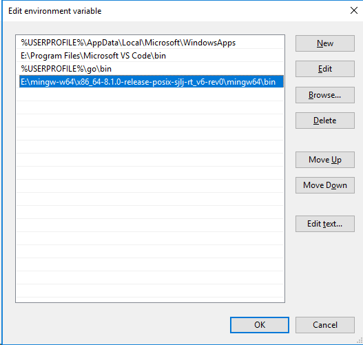

环境变量配置好以后，在cmd可以执行`gcc -v`检查一下有没有成功，会打印**gcc**的版本信息：  

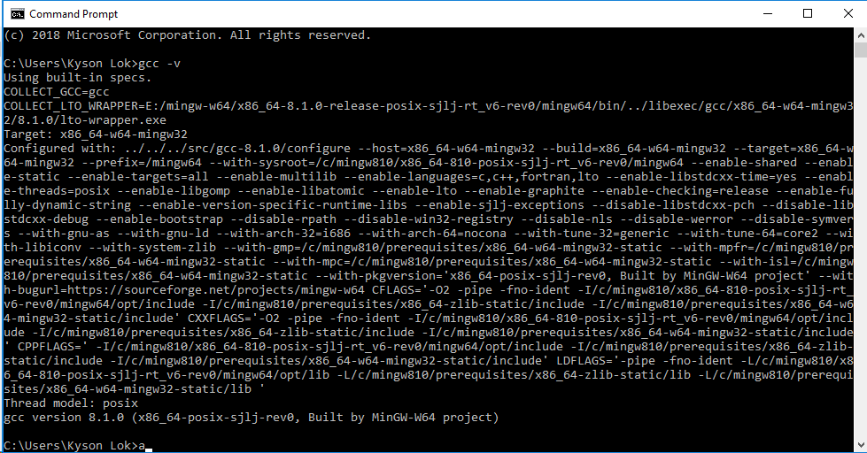

#### 运行Makefile  

虽然**gcc**没有问题了，但是仍然找不到**make**命令，我们可以进入`mingw64\bin`目录，找到**mingw32-make.exe**，并且复制一份，重命名为**make.exe**。  

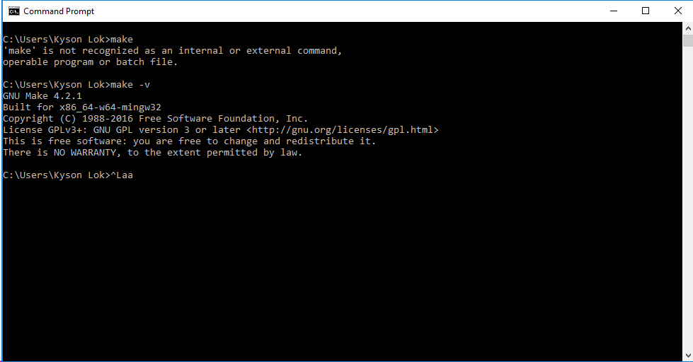

#### C/CPP开发环境测试  

编写个demo来简单测试下我们搭建的环境，一切都没有问题的话，能够编译c文件，并且运行：  

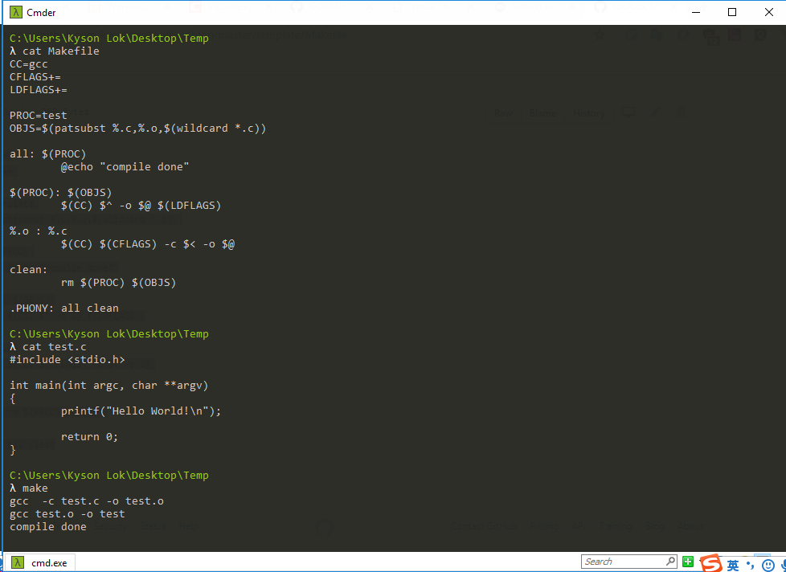

### 配置编译器  

1. 在VSCode打开一个工作目录；  

2. 按下`Ctrl + Shift + P`快捷键打开命令面板；  

3. 输入"C/C++"，在推荐列表选择**Edit Configurations**，会打开一个名称为`c_cpp_properties.json`的配置文件；  

   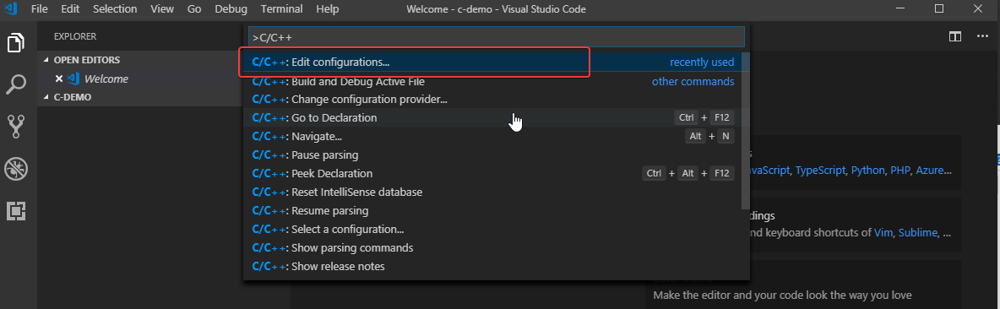

4. 在配置文件里找到`compilerPath`变量，将其值用Mingw-w64的gcc路径替换，如`E:\\mingw-w64\\x86_64-8.1.0-release-posix-sjlj-rt_v6-rev0\\mingw64\\bin\\gcc.exe`  

5. 继续将`intelliSenseMode`变量的值替换为`gcc-x64`。

6. 还可以修改`includePath`变量，告诉编译器头文件的路径，最终的文件大致是这样：  

   ```  
   {
       "configurations": [
           {
               "name": "Win32",
               "includePath": [
                   "${workspaceFolder}/**"
               ],
               "defines": [
                   "_DEBUG",
                   "UNICODE",
                   "_UNICODE"
               ],
               "compilerPath": "E:\\mingw-w64\\x86_64-8.1.0-release-posix-sjlj-rt_v6-rev0\\mingw64\\bin\\gcc.exe",
               "cStandard": "c11",
               "cppStandard": "c++17",
               "intelliSenseMode": "gcc-x64"
           }
       ],
       "version": 4
   }
   ```

### 创建编译任务  

1. 按下`Ctrl + Shift + P`快捷键打开命令面板；  

2. 输入"tasks"，在推荐列表选择**Configure Task > Create tasks.json file from template > Others**，用以下的内容替换：  

   ```   
   {
       "version": "2.0.0",
       "tasks": [
           {
               "label": "build hello world",
               "type": "shell",
               "command": "gcc",
               "args": [
                   "-g",
                   "-o",
                   "helloworld",
                   "helloworld.c"
               ],
               "group": {
                   "kind": "build",
                   "isDefault": true
               }
           }
       ]
   }
   ```

3. 创建`helloworld.c`，编写一个demo代码，按下`F5`进行编译调试。  
