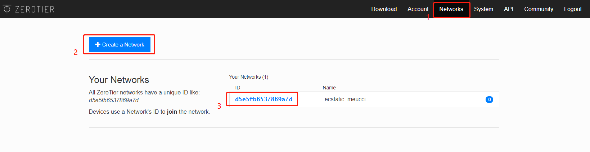
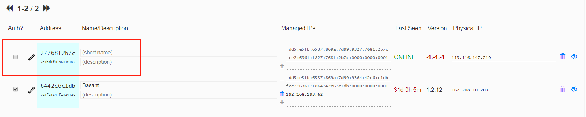
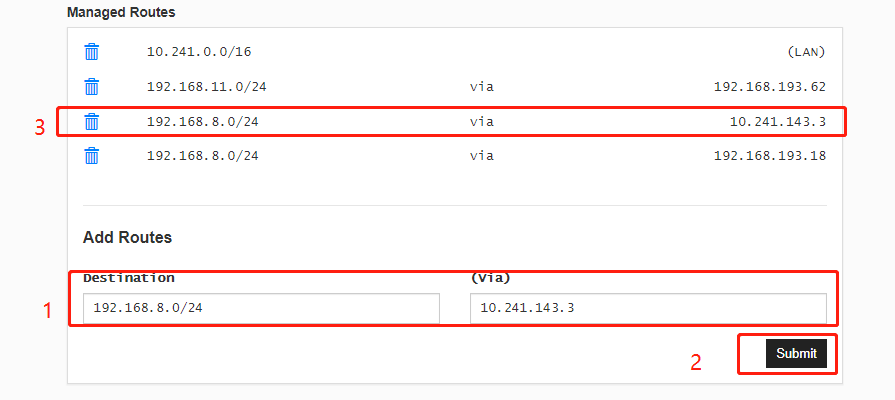
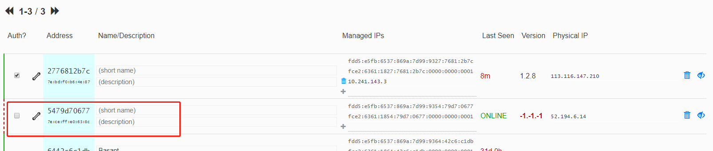

## Presentation 

In this test, we set up Zerotier on GL.iNet's mini-routers and an Ubuntu VPS so that they can access each other. To use ZeroTier service, you need to create your own ZeroTier account. Sign up for an account here: https://my.zerotier.com/login.  

**Important: Stop other VPN service on the router before you start is recommended**  

Login your ZeroTier account. Go to *Network* menu and click on **Create** button
to create a new network.  

Next you should see the configuration page of your network. Please jot down the **Network ID** which will be used later.  



## Setup ZeroTier on router  

### Installation  

SSH to the router, and execute the following commands to install ZeroTier package:  

```  
opkg update
opkg install zerotier
```  

### Configuration  

#### ZeroTier  

You should edit the configuration file */etc/config/zerotier* to enable ZeroTier
and join into a network. It looks like:  

```  
# cat /etc/config/zerotier
config zerotier 'sample_config'
	option enabled '1'
	list join 'd5e5fb6537869a7d'
```  

Please replace the code above **d5e5fb6537869a7d** with your own Network ID.

#### Firewall(optional)  

If you want to access the router's LAN, you have to configure the firewall as
well. Please edit the firewall configuration file */etc/config/firewall*. Add
below lines into it.  

```  
config zone 'vpn_zone'
	option name 'zerotier'
	option input 'ACCEPT'
	option forward 'REJECT'
	option output 'ACCEPT'
	option device 'zt+'
	option masq '1'
	option mtu_fix '1'

config forwarding
	option dest 'zerotier'
	option src 'lan'

config forwarding
	option dest 'lan'
	option src 'zerotier'
```  

### Start ZeroTier Service  

```  
/etc/init.d/zerotier restart
/etc/init.d/firewall restart
```  

Go back to your Zerotier's web console and you will see the device which you just joined. Check the checkbox of "Auth?", otherwise, your device may not be able to get an IP address from ZeroTier.  



After authentication, the network interface will obtain an IP address. Check it
out via `ifconfig`, it looks like:    

```  
# ifconfig 
ztwdjh372k Link encap:Ethernet  HWaddr 7E:BD:F0:B6:4E:87  
          inet addr:10.241.143.3  Bcast:10.241.255.255  Mask:255.255.0.0
          inet6 addr: fdd5:e5fb:6537:869a:7d99:9327:7681:2b7c/88 Scope:Global
          inet6 addr: fce2:6361:1827:7681:2b7c::1/40 Scope:Global
          inet6 addr: fe80::7cbd:f0ff:feb6:4e87/64 Scope:Link
          UP BROADCAST RUNNING MULTICAST  MTU:2800  Metric:1
          RX packets:39 errors:0 dropped:0 overruns:0 frame:0
          TX packets:68 errors:0 dropped:0 overruns:0 carrier:0
          collisions:0 txqueuelen:1000 
          RX bytes:1638 (1.5 KiB)  TX bytes:4368 (4.2 KiB)
```  

### Managed Routes(optional)  

You can manage route in ZeroTier's web console. For example, I add a static route on **Managed Routes**, so that I can access the router's LAN.  



## Setup ZeroTier on Ubuntu  

### Installation  

Install ZeroTier and join the network which you created before.  

```  
curl -s https://install.zerotier.com/ | sudo bash
sudo zerotier-cli join d5e5fb6537869a7d
```  

Please replace the code above **d5e5fb6537869a7d** with your own Network ID.  

You need to check the checkbox of "Auth?" in ZeroTier's web console as well.  



After authentication, the network interface will obtain an IP address. Check it
out via `ifconfig`, it looks like:    

```  
# ifconfig 
ztwdjh372k: flags=4163<UP,BROADCAST,RUNNING,MULTICAST>  mtu 2800
        inet 10.241.116.0  netmask 255.255.0.0  broadcast 10.241.255.255
        inet6 fe80::7cce:ffff:fee0:638c  prefixlen 64  scopeid 0x20<link>
        inet6 fdd5:e5fb:6537:869a:7d99:9354:79d7:677  prefixlen 88  scopeid 0x0<global>
        inet6 fce2:6361:1854:79d7:677::1  prefixlen 40  scopeid 0x0<global>
        ether 7e:ce:ff:e0:63:8c  txqueuelen 1000  (Ethernet)
        RX packets 0  bytes 0 (0.0 B)
        RX errors 0  dropped 0  overruns 0  frame 0
        TX packets 85  bytes 4266 (4.2 KB)
        TX errors 0  dropped 0 overruns 0  carrier 0  collisions 0
```  

## Testing  

The router and the Ubuntu VPS are able to ping each other.  

```  
kyson@ip-172-31-34-95:~$ ping 10.241.143.3
PING 10.241.143.3 (10.241.143.3) 56(84) bytes of data.
64 bytes from 10.241.143.3: icmp_seq=1 ttl=64 time=1143 ms
64 bytes from 10.241.143.3: icmp_seq=2 ttl=64 time=132 ms
64 bytes from 10.241.143.3: icmp_seq=3 ttl=64 time=65.6 ms
64 bytes from 10.241.143.3: icmp_seq=4 ttl=64 time=65.7 ms
64 bytes from 10.241.143.3: icmp_seq=5 ttl=64 time=65.8 ms
```  

```  
root@GL-AR300M:/# ping 10.241.116.0
PING 10.241.116.0 (10.241.116.0): 56 data bytes
64 bytes from 10.241.116.0: seq=0 ttl=64 time=66.097 ms
64 bytes from 10.241.116.0: seq=1 ttl=64 time=66.264 ms
64 bytes from 10.241.116.0: seq=3 ttl=64 time=65.377 ms
64 bytes from 10.241.116.0: seq=4 ttl=64 time=65.222 ms
```  

The Ubuntu VPS can reach router's LAN if you configure the route.  

```  
kyson@ip-172-31-34-95:~$ ping 192.168.8.1
PING 192.168.8.1 (192.168.8.1) 56(84) bytes of data.
64 bytes from 192.168.8.1: icmp_seq=1 ttl=64 time=65.7 ms
64 bytes from 192.168.8.1: icmp_seq=2 ttl=64 time=66.0 ms
64 bytes from 192.168.8.1: icmp_seq=3 ttl=64 time=65.6 ms
64 bytes from 192.168.8.1: icmp_seq=4 ttl=64 time=65.8 ms
64 bytes from 192.168.8.1: icmp_seq=6 ttl=64 time=65.2 ms
```  

## Troubleshooting  

If everthing is fine, but you can't reach the router from Ubuntu VPS. It usually caused by **mwan3**, you can try to stop and remove it.  

```  
mwan3 stop
opkg remove mwan3 --force-depends
```  

