# 无线WiFi四次握手分析  

## 0x00 写在前面  

客户使用我们的路由器发现有一台 Chromebook 连不上 WiFi，并且用抓包软件抓取了无线数据发给我们分析。为了分析抓包结果，我特意查了一下关于无线认证关联和握手的资料，因此有了这篇文章。  

## 0x01 什么是四次握手  

四次握手是 AP（authenticator）和 Station（supplicant ）进行四次消息交换的过程，进行四次握手是为了生成一个用于加密无线数据的密钥。  

要了解四次握手的过程，我们先来认识一些相关术语。  

## 0x02 看懂专业术语  

### PTK (Pairwise Transit Key)  

PTK 用来加密 AP 和 Station 通讯的单播数据包，AP 与每个 Station 通讯用的 PTK 都是唯一的。我们来看一下生成 PTK 的函数，参数是生成 PTK 需要的信息：  

`PTK = PRF(PMK + ANonce + SNonce + Mac(AA) + Mac(SA))`  

**PRF**是 pseudo-random function 的缩写，表示伪随机函数，PMK、ANonce、SNonce、Mac(AA) 和Mac(SA) 作为它的输入参数；  

**PMK** 下面会谈到；  

**ANonce **是 AP 生成的随机数，A 表示 authenticator；  

**SNonce** 是 Station 生成的随机数，S 表示 supplicant；  

**Mac(AA) ** 是 AP 的 Mac 地址；  

**Mac(SA)** 是 Station 的 Mac 地址；  

由此可知，生成 PTK 依赖 PMK。  

### GTK (Group Temporal Key)  

GTK 用来加密 AP 和 Station 通讯的多播/广播数据包，连接该 AP 的所有 Station 共享一个 GTK。生成 GTK 的公式：  

`GTK = PRF(GMK + ANonce + Mac(AA))`  

与 PTK 不同的是没有 SNonce 和 Mac(SA)，GTK 也依赖 GMK。  

### PMK (Pairwise Master Key)  

PMK 是由 MSK 生成，WPA2/PSK 的情况下，当 supplicant 和 authenticator 身份验证后，PSK 变成 PMK。PMK 会驻留在 AP 和所有 Station，不需要进行 key 交换，用它来生成用于加密单播数据的PTK。  

### GMK (Group Master Key)  

GMK 用在四次握手来生成 GTK，GTK 在 AP 端由 MSK 生成，所有连接到该 AP 的 Station 共享。

### MSK (Master Session Key)  

由 802.1X/EAP 或  PSK 身份认证后生成的第一个密钥。  

### MIC(Message Integrity Check)  

消息完整性校验，针对一组需要保护的数据计算出的散列值，用来防止数据遭篡改。  

### Key分层  

我们用个金字塔模型把这些 Key 分层：  

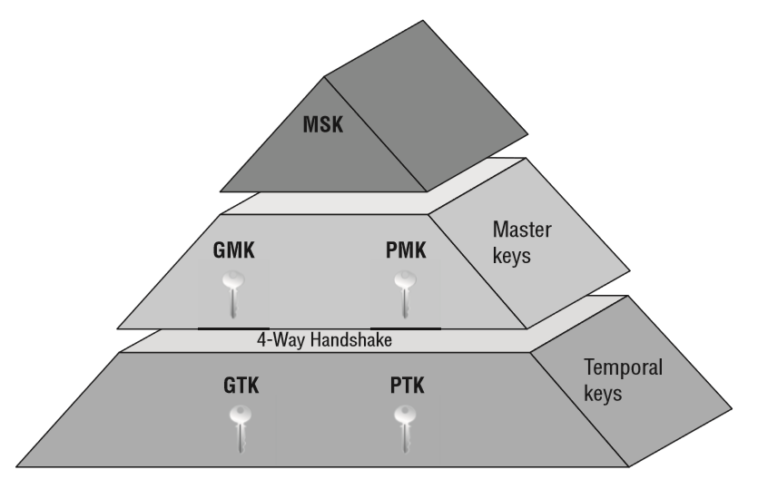

1. 金字塔顶层是 MSK，在 802.1X/EAP 或者 PSK 身份认证的过程生成；  

2. 金字塔中间层是 GMK 和 PMK，由 MSK 生成；    

3. 金字塔底层是 GTK 和 PTK，用来加密数据的。  

## 0x03 四次握手剖析  

### 四次握手概述  

无线 WiFi 的四次握手就是 key exchange 的过程，上面我们已经了解了相关的 key，现在我们就可以具体分析一下四次握手的过程。  

假设 AP 用的是 WPA2/PSK 加密方式，SSID 为 Test，用一台电脑连接它。整个过程分为身份认证（authentication）、关联（association）和安全验证（security validation）。四次握手不是直接将密码发送到 AP，而是通过 EAPOL（Extensible authentication protocol over LAN）进行消息交换。  

先是身份认证（authentication），身份认证阶段不需要考虑安全问题，因为在这个阶段只是 AP 要确认 Station 是不是 802.11 设备，确认彼此可以正常通讯。  

接着是关联（association），Station 与 AP 关联以便获得网络的完全访问权，关联成功后，Station 会收到AP的响应，包含了成功的状态码和关联标识符。  

最后进行安全性校验，然后 AP 发起四次握手。  

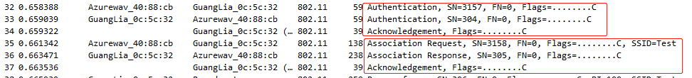

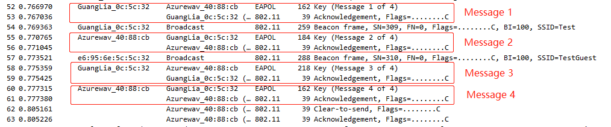

### 4-Way Handshake Message 1  

由 AP 发起四次握手，AP 发送一条包含 ANonce 的消息到 Station，Station 用它生成 PTK，前面已经提到生成 PTK 的公式：`PTK = PRF (PMK + ANonce + SNonce + Mac (AA)+ Mac (SA))`，由于在 4 次握手之前已经经历了认证和关联的阶段，因此 Station 是知道 AP 的 Mac 地址，所以只需要 ANonce就可以生成 PTK 了。  

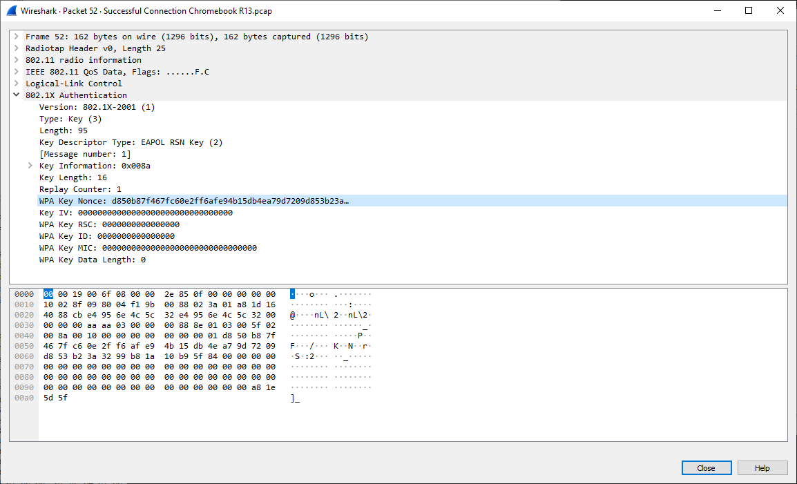

### 4-Way Handshake Message 2  

一旦 Station 创建了自己的 PTK，它会立即响应一条 EAPOL 消息给 AP，包含了 SNonce 和 MIC。AP 用 SNonce 生成自己的 PTK，MIC 是用来校验 Station 发来的消息的完整性，除了 1/4，从 2/4 报文开始，后面的每个报文都会有 MIC。AP 收到 SNonce 之后，生成的 PTK 就可以用来加密后面两次握手的 key 了。  

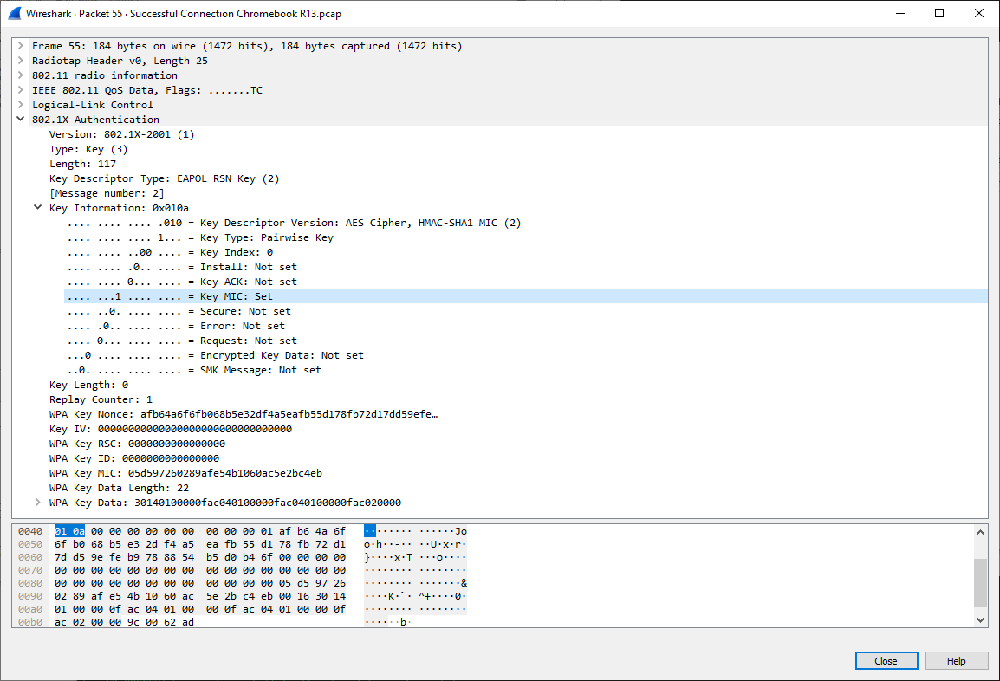

### 4-Way Handshake Message 3  

这次握手主要是把 GTK 发送给 Station，并且告知 Station 安装 PTK 和 GTK。由于第二次握手生成了 PTK，可以用来加密数据了，所以这里对 GTK 进行了加密。  

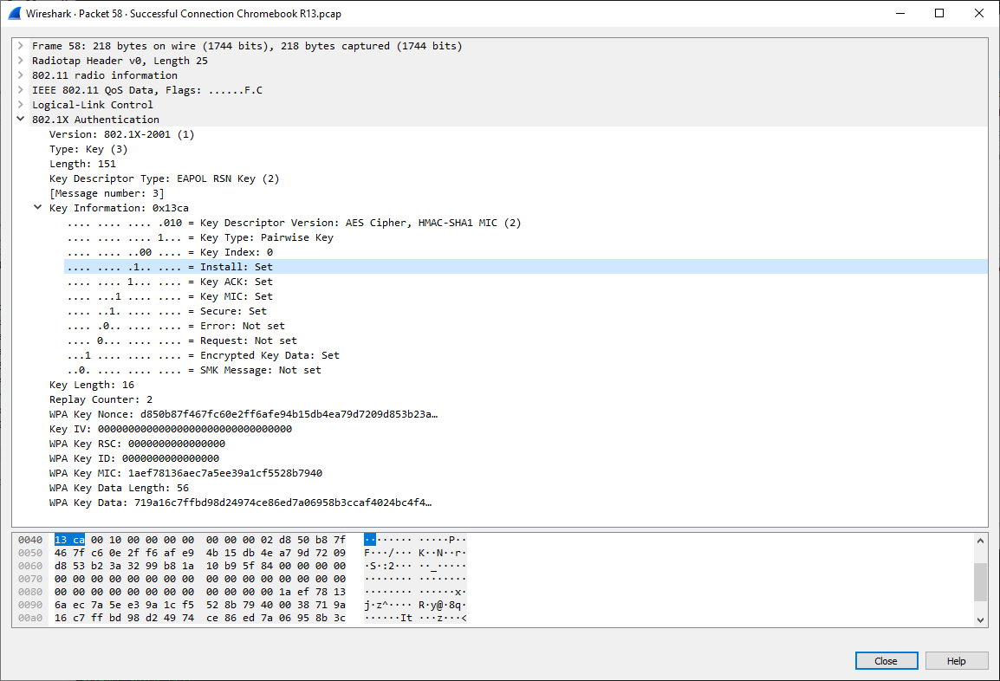

### 4-Way Handshake Message 4  

第四次是最后一条 EAPOL 消息，相当于一个确认包，告诉 AP PTK 已经安装好，AP 收到该消息后，也安装 PTK。安装的意思是指使用 PTK 和 GTP 来对数据进行加密。  

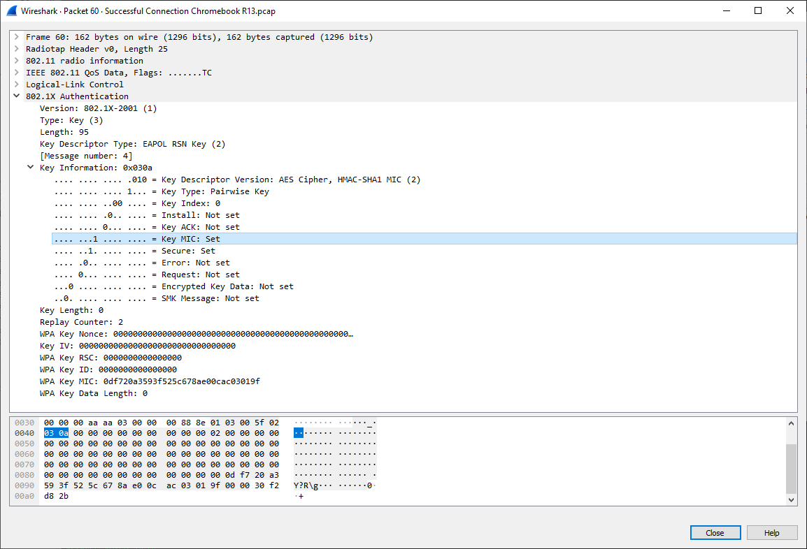

### Controlled Port Unlocked  

双方完成认证以后，authenticator 的控制端口将会被打开，这样 802.11 的数据帧将能够正常通过，而且所有的单播数据帧将会被 PTK 保护，所有的组播数据以及广播数据将会被 GTK 保护。

Supplicant 和 Authenticator 就此完成密钥派生和组对， 双方可以正常进行通信了。

## 0x04 WireShark 802.11过滤规则  

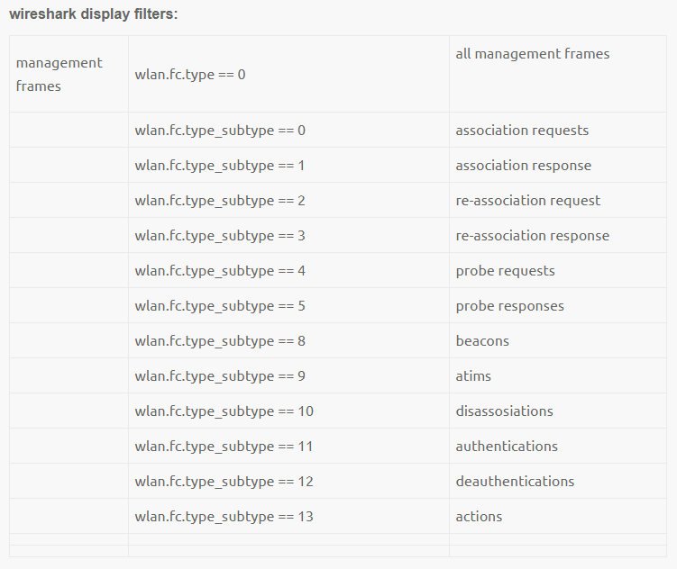

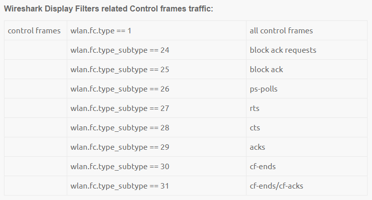

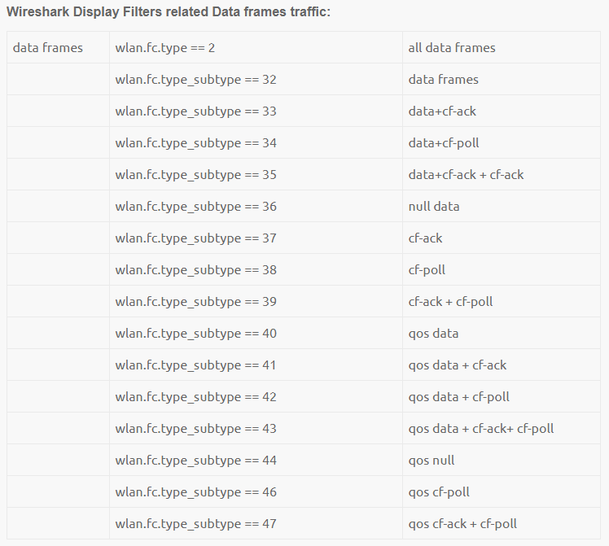

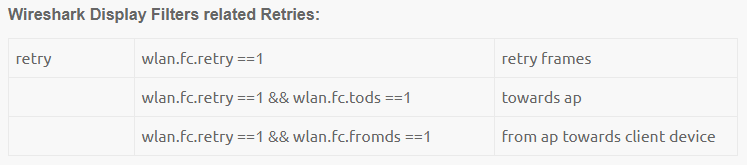

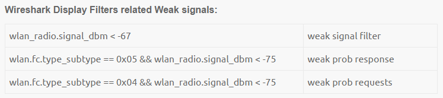

## 0x05 总结  

Station 扫描 AP 有两种模式，主动扫描和被动扫描。我们这里用的是主动扫描，Station 发起 Probe Reques t帧，AP 响应 Probe Response 帧。连接过程，Station 发起认证关联请求，由 unauthenticated 和 un-associated 状态转变为 authenticated 和 associated，通过安全检查之后 AP 发起四次握手。四次握手成功后，双方就开始正常通信了。  

