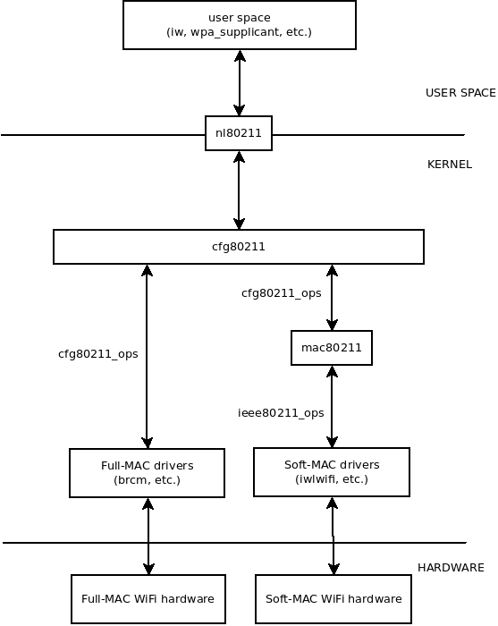

# Overview  
  
To be able to control wireless drivers from userspace, some IPC communication processes between kernel and userspace are used.  
  
- At first ioctl with vendor dependent APIs was used.  
- In 1996, Jean Tourrilhes creates [wireless extensions](http://www.hpl.hp.com/personal/Jean_Tourrilhes/Linux/Tools.html) (WE or WEXT).  
  
>> The Wireless Extension (WE) is a generic API allowing a driver to expose to the user space configuration and statistics specific to common Wireless LANs.  
  
- In 2006, John Linville creates [mac80211](http://wireless.kernel.org/en/developers/Documentation/mac80211) and Johannes Berg creates [cfg80211](http://wireless.kernel.org/en/developers/Documentation/cfg80211) and [nl80211](http://wireless.kernel.org/en/developers/Documentation/nl80211). Together it is intended to replace wireless extensions.  
  
```bash  
+-------------+
|             |
|  Userspace  |
|             |
+-------------+
      ^
- - - | - - - - 
      | nl80211
      v
+-------------+
|             |
|  cfg80211   |
|             |
+-------------+
+-------------+
|             |
|  mac80211   |
|   driver    |
|             |
+-------------+
```  
  
An important point is that nl80211/cfg80211/mac80211 no longer use ioctl, they use [netlink](http://en.wikipedia.org/wiki/Netlink).  
  
So, tools like [iw](http://wireless.kernel.org/en/users/Documentation/iw), [hostapd](http://hostap.epitest.fi/hostapd/) or the [wpa_supplicant](http://hostap.epitest.fi/wpa_supplicant/) use some netlink libraries (like [libnl](http://www.carisma.slowglass.com/~tgr/libnl/) or [libnl-tiny](https://dev.openwrt.org/browser/trunk/package/libs/libnl-tiny)) and the netlink interface public header which is of course [nl80211.h](http://lxr.free-electrons.com/source/include/uapi/linux/nl80211.h).  
  
There is not so much documentations, but I advice you to read the [libnl documentation](http://www.carisma.slowglass.com/~tgr/libnl/doc/core.html) and then the [iw source code](http://git.kernel.org/cgit/linux/kernel/git/jberg/iw.git) (because iw use libnl).  
  
  
# Mac80211 Framework  
  
- `nl80211` is the interface between user space software (`iw`, `wpa_supplicant`, etc.) and the kernel (`cfg80211` and `mac80211` kernel modules, and specific drivers).  
- The WiFi drivers and hardware could be Full-MAC or Soft-MAC (see Wireless_network_interface_controller).  
- `cfg80211_ops` is a set of operations that Full-MAC drivers and `mac80211` module register to cfg80211 module.  
- `ieee80211_ops` is a set of operations that Soft-MAC drivers register to `mac80211` module.  
  
  
  
  
# References  

[How nl80211 library & cfg80211 work?](https://stackoverflow.com/questions/21456235/how-nl80211-library-cfg80211-work)  
