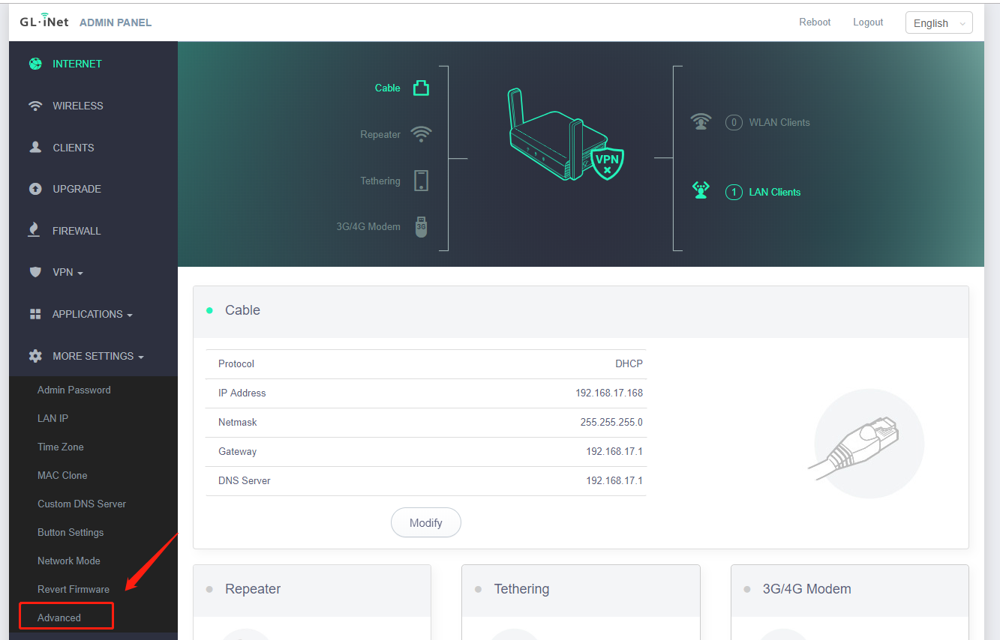
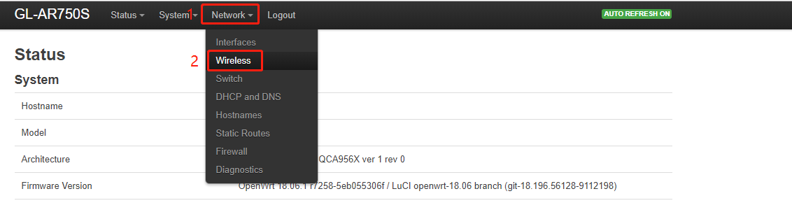
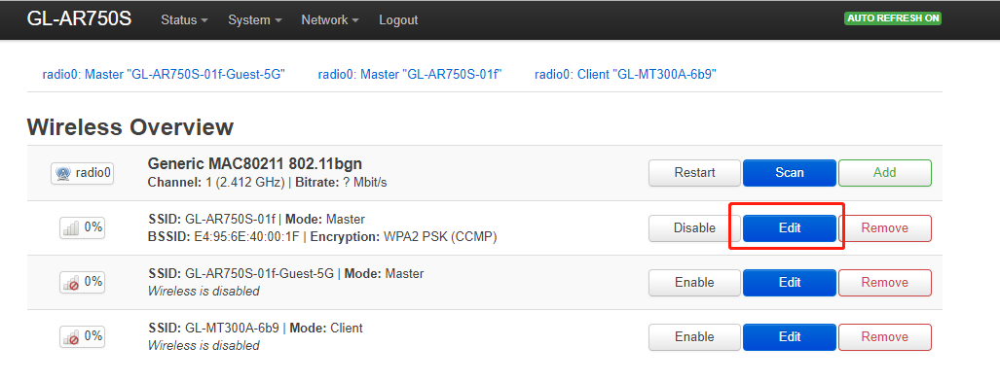
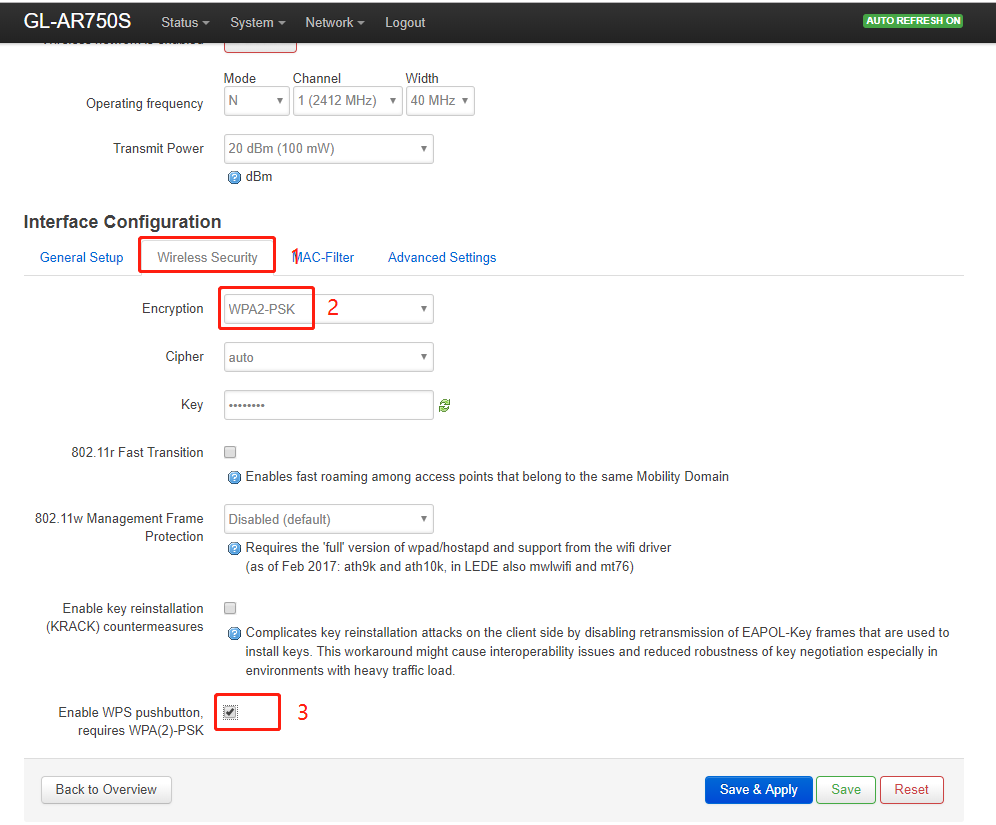

## Installation

Login to web UI, go to *APPLICATION* > *Plug-ins*. First, click on **Update** button to update the metadata for packages. Then, search and install **hostapd-utils**.


## WPS for AP

### Enable WPS

After installed the package, you should go to *MORE SETTINGS* > *Advanced* > *Network* -> *Wireless* to enable the WPS function.






Selecting the wireless interface which you want to enable WPS. Changing to **Wireless Security** tab, and ticked **Enable WPS pushbutton**, and change the encryption to **WPA2-PSK**. 

Please note that the encryption must be WPA2-PSK, otherwise it will not work. Finally, click on "Save & Apply".





### Change reset Button to WPS

Using WinSCP drag and drop the reset file to /etc/rc.button folder. If you don’t know how to use WinSCP, please refer to our instruction. https://docs.gl-inet.com/en/3/app/ssh/#winscp

Now, you can press the reset button to active WPS function.

The full reset file as below. You can new a file, and copy & paste the content into it. 

```  
#!/bin/sh

if [ "$ACTION" = "pressed" -a "$BUTTON" = "reset" ]; then
	cd /var/run/hostapd
	for socket in *; do
		[ -S "$socket" ] || continue
		hostapd_cli -i "$socket" wps_pbc
	done
fi

return 0
```  

## WPS for Station  

For the sake of convenience, you should connect to an exist AP at first, because of station mode depends on some configuration files, such as firewall, network and dhcp. If you hadn't been connected a AP, you have to configure them manually.

When the AP activated WPS, you can type this command on mini-router to connect it.  

```  
wpa_cli -i wlan-sta wps_pbc
```  

Please note that you might need to stop the **gl_health** process via `killall gl_health && mv /usr/bin/gl_health /usr/bin/gl_health1`.
